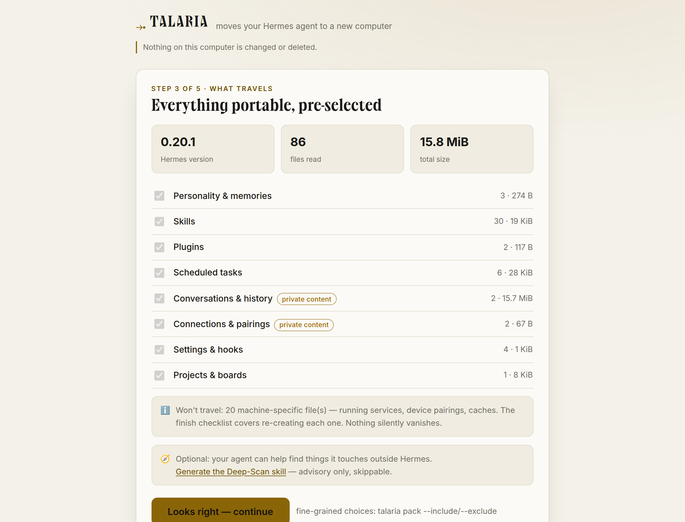
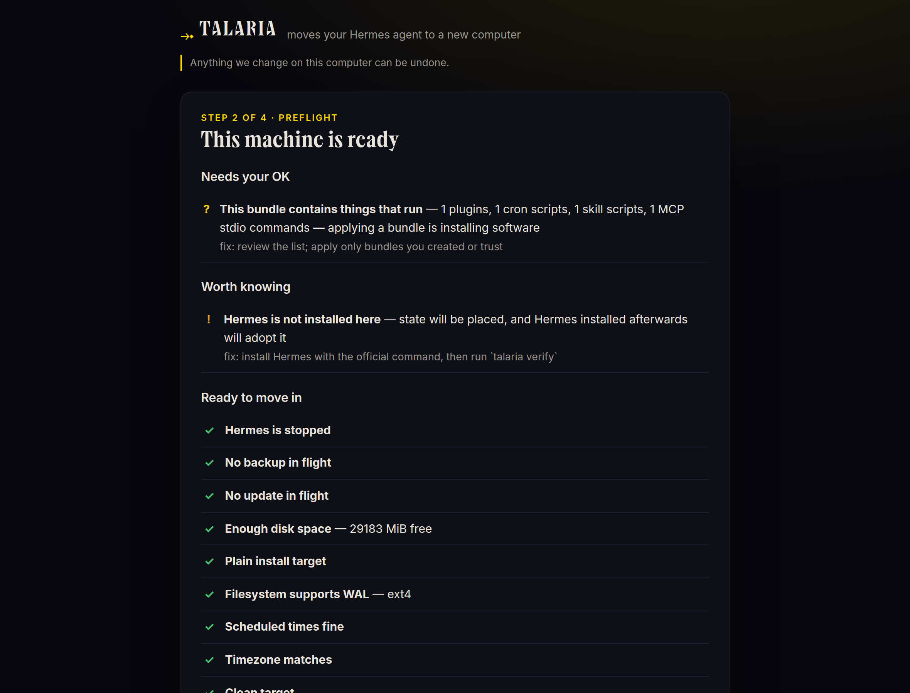
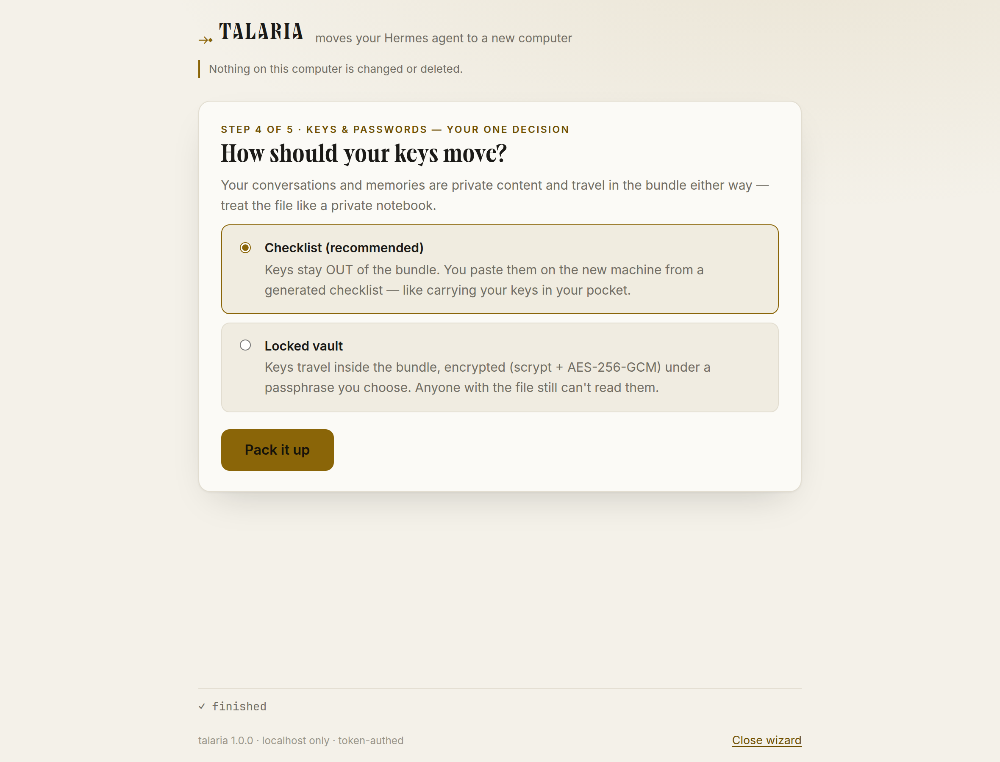
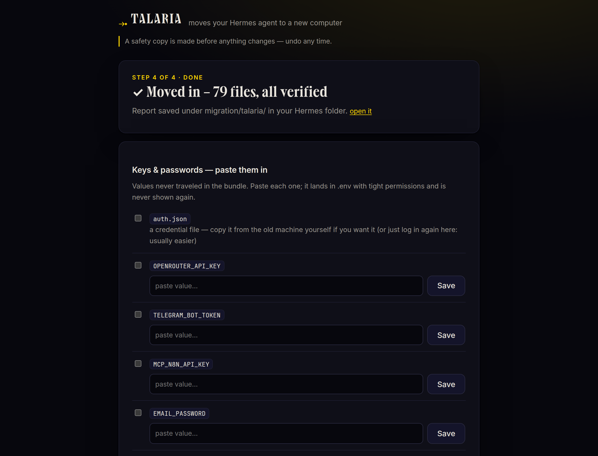

<p align="center">
  
</p>

<p align="center">
  
  
  
  
  
</p>

<p align="center">
  <b>Pack your whole <a href="https://github.com/NousResearch/hermes-agent">Hermes Agent</a> into one file. Move it to any computer. Unpack it there — verified, with an undo button.</b>
</p>

<p align="center">
  <i>Soul · memories · skills (including the ones the agent wrote itself) · scheduled jobs · conversations · pairings · settings.</i><br>
  <sub>Community tool. Not affiliated with Nous Research.</sub>
</p>

---

```
   the old computer                                       the new computer
  ┌──────────────────┐         one portable file         ┌──────────────────┐
  │   $ talaria      │  ───►  hermes-atlas-2026-08.   ──► │   $ talaria      │
  │   pack wizard    │            hermespack              │   apply wizard   │
  └──────────────────┘                                    └──────────────────┘
   read-only, untouched                                   staged · backed-up · verified · undoable
```

<table>
<tr>
<td width="50%"></td>
<td width="50%"></td>
</tr>
<tr>
<td align="center"><b>Pack:</b> everything portable, pre-selected — with sizes, provenance, and what <i>won't</i> travel.</td>
<td align="center"><b>Apply:</b> every check grouped by who acts — ready, we'll-fix, needs-you, can't-come-along.</td>
</tr>
<tr>
<td width="50%"></td>
<td width="50%"></td>
</tr>
<tr>
<td align="center"><b>Your one decision:</b> keys stay on a checklist, or travel in an encrypted vault.</td>
<td align="center"><b>Done:</b> verified counts, paste-in keys, re-pair cards, and one-click undo.</td>
</tr>
</table>

## The three promises

> Enforced by the test suite, printed on every data-touching screen.

1. **Nothing on the old computer is changed or deleted.** Capture is strictly read-only.
2. **Anything changed on the new computer can be undone.** Apply is transactional — safety copy first, journaled, verified, `talaria rollback` any time.
3. **Anything that can't move automatically goes on your checklist.** Nothing silently vanishes.

## Quick start

```bash
pipx install talaria-migration          # or: pip install talaria-migration
talaria                                 # opens the wizard in your browser
```

Zero dependencies — the core is pure Python 3.9+ standard library, so it runs on a fresh
machine before Hermes is even installed there. Or carry the single self-contained file:

```bash
python3 talaria.pyz                      # ~430 KiB, runs on any Python
```

<details>
<summary><b>Sixty seconds, on the command line</b></summary>

```bash
# Old machine — pack (2 questions, Enter accepts both):
talaria pack
#  → hermes-atlas-2026-08-15.hermespack   + a keys checklist (HTML)

# New machine — apply:
talaria apply hermes-atlas-2026-08-15.hermespack
#  → preflight verdicts → safety copy → move in → verify → finish checklist

# Not happy? Any time until you trust it:
talaria rollback
```

Full capability parity between the GUI and CLI — `--json` everywhere, `--dry-run` on
everything that writes. Most Hermes installs live on a `$5` VPS; Talaria is built for SSH.
</details>

## Why it's not just a zip

Talaria doesn't copy a folder — it **understands the install**, because it was built from a
deep reading of the Hermes source ([research notes](docs/research/)).

| | |
|---|---|
| 🧬 **Stock vs. yours** | Hermes edits its own skills. Talaria tags every skill — stock-pristine, stock-**modified** (with per-file diffs), hub, org, agent-created, user-created — using Hermes' own provenance data. Config and SOUL.md are diffed against the shipped defaults. |
| 🧩 **Dependency verdicts per target OS** | Every cron job, skill, MCP server, and provider is checked for what it needs. `bash` on Windows? Marked **impossible** *before* you move — fully offline against a declared `--target-os`. |
| 🔐 **Secrets never travel in plaintext** | ~40 kinds of keys stay OUT of the bundle by default — you get a checklist with provider links and paste-back on the new machine. Opt-in vault (scrypt · AES-256-GCM) if you want them to travel. |
| 🧱 **Machine-bound intelligence** | Gateway state, device-linked WhatsApp/Signal sessions, locks, PIDs — excluded on *both* sides (even a hostile bundle can't plant them), with one-minute re-pair cards instead. |
| ⏰ **Cron migrated correctly** | Runtime claims scrubbed, interval anchoring preserved, monitor baselines carried, `context_from` chains kept together, timezone shifts flagged with the exact consequence. |
| 💾 **Live databases stay intact** | SQLite stores are snapshotted WAL-consistently and integrity-checked — never file-copied hot. |
| ♻️ **Transactional apply** | Write-ahead journal, per-file backups, hash-verified placement, automatic rollback. A power loss mid-apply leaves a machine that restores to byte-identical pre-apply state — tested by killing the process mid-flight. |
| 📄 **Reports that stand alone** | A System Overview of everything your install is and touches, and a Migration Report of everything that happened — self-contained HTML, redacted by default, printable. |
| 🧭 **The agent helps, never decides** | `talaria deepscan` hands your Hermes a skill to report what it touches day-to-day (names, never values); ingest verifies every claim, refuses sensitive paths, and can only *suggest* additions you approve. |

## Put the other tool to shame

Every row traces to a documented weakness of the other Hermes migration tool
([teardown](docs/research/competitor-teardown.md)) and a requirement our tests enforce.

| | [Hermes-Agent-Converter](https://github.com/X3N064/Hermes-Agent-Converter) | **Talaria** |
|---|:---:|:---:|
| Platforms | Linux/WSL ↔ macOS only | Linux · macOS · **Windows** · WSL · Termux |
| GUI | tkinter (often missing) | localhost web app, zero deps + full CLI |
| Understands files | ❌ blind tree copy | ✅ typed catalog, `why` for every path |
| Stock vs. modified skills | ❌ | ✅ six provenance tags + diffs |
| Dependency checks | ❌ | ✅ per-target-OS, offline capable |
| Secrets | ❌ **plaintext in the zip** | ✅ excluded + checklist, or encrypted vault |
| Machine-bound state | ❌ copied (breaks gateway) | ✅ excluded both sides + re-pair cards |
| Live databases | ❌ raw copy (WAL corruption) | ✅ snapshot + integrity check |
| Path rewriting | ❌ blanket regex over code | ✅ structural, per-format, previewable |
| Apply | ❌ extract over live install | ✅ transactional, journaled, auto-rollback |
| Zip-slip / bombs | ❌ broken prefix guard | ✅ full hardening + adversarial tests |
| Verification | ❌ none | ✅ per-file hashes + health checks |
| Tests | ❌ none | ✅ 272 (unit, integration, crash-injection, GUI, browser, adversarial) |

## Prefer the terminal?

`talaria gui` is optional. The full surface is on the command line, with `--json`
everywhere:

```
talaria                 wizard (auto-detects direction)
talaria scan            typed inventory of the install
talaria diff            stock-vs-yours: skills | config | checkout
talaria deps            dependency verdicts (--target-os, --live)
talaria pack            build the bundle (+ keys checklist)
talaria inspect         look inside a bundle (--verify --deps --salvage …)
talaria preflight       check THIS machine against a bundle
talaria apply           transactional restore (--dry-run, --only/--skip)
talaria verify          re-verify; --watch for the heartbeat
talaria rollback        undo the last apply
talaria report          System Overview (html / md / json)
talaria why PATH        what is this file, does it travel, and why
talaria deepscan        agent-assisted discovery (generate | ingest)
```

## Docs

| | |
|---|---|
| [**User guide**](docs/user-guide.md) | both sides of a move, every option |
| [**FAQ**](docs/faq.md) | vault vs checklist, clone vs replace, profiles, Termux |
| [**Troubleshooting**](docs/troubleshooting.md) | every `TAL-` error code, with fixes |
| [**Security**](docs/security.md) · [**Review**](docs/security-review.md) | threat model; the adversarial hardening pass and its 11 fixed findings |
| [**Bundle format**](docs/bundle-format.md) | `.hermespack` layout, read-forever policy |
| [**Design**](docs/design/SPEC.md) · [**Architecture**](docs/design/ARCHITECTURE.md) | the binding spec (122 requirements) from an adversarial design committee |

## How it was built

An adversarial process, start to finish: five agents mapped the Hermes source → four design
lenses proposed, three adversarial critics tore them apart, and a binding spec settled it →
spec/TDD implementation → and after "done," a hostile bug-hunt found **11 real defects the
267-test suite missed** (a vault arbitrary-write, unappliable bundles, a rollback that could
lose database WAL data) — all fixed with reproducing tests. That story is in
[`docs/`](docs/).

## Development

```bash
pip install -e ".[dev]"
python3 -m pytest                       # the full suite (272 tests)
python3 scripts/build_pyz.py            # single-file build
python3 scripts/capture_screens.py      # regenerate the screenshots (light + dark)
```

<p align="center"><sub>MIT licensed · <code>⤞</code> Talaria, for Hermes' winged sandals</sub></p>
