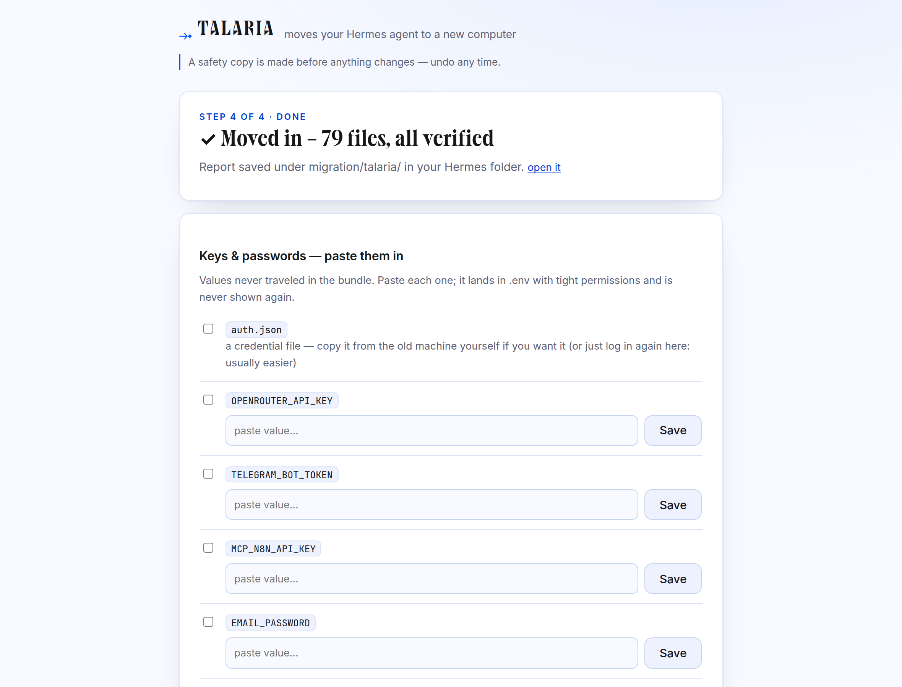

# ⤞ Talaria — moves your Hermes agent to a new computer

Pack your whole [Hermes Agent](https://github.com/NousResearch/hermes-agent) — soul,
memories, skills (including the ones the agent wrote itself), scheduled tasks,
conversations, pairings, and settings — into **one file**. Move it to any other
computer. Unpack it there, verified, with an undo button.

*Community tool. Not affiliated with Nous Research.*

```
old computer                                new computer
────────────                                ────────────
$ talaria            →  hermes-atlas-2026-08-15.hermespack  →  $ talaria
  (pack wizard)             one self-contained file              (apply wizard)
```

**The three promises** (product law, enforced by the test suite):

1. **Nothing on the old computer is changed or deleted.** Capture is strictly read-only.
2. **Anything changed on the new computer can be undone.** Apply is transactional —
   safety copy first, journaled, verified, `talaria rollback` any time.
3. **Anything that can't move automatically goes on your checklist.** Nothing silently
   vanishes.

| | |
|---|---|
|  |  |
| *What travels — everything portable, pre-selected* | *Moved in, verified, with the keys checklist* |

## Install

```bash
pipx install talaria-migration        # or: pip install talaria-migration
talaria                               # opens the wizard (GUI in your browser)
```

No dependencies. The core is pure Python 3.9+ standard library — it runs on a fresh
machine before Hermes (or anything else) is installed there. Or grab the single-file
[`talaria.pyz`](dist/) and run `python3 talaria.pyz`. Optional: `pip install
cryptography` enables the encrypted key vault.

Works on Linux, macOS, Windows (native `%LOCALAPPDATA%\hermes` and WSL), and Termux.

## Sixty seconds of usage

```bash
# Old machine — pack (2 questions, Enter accepts both):
talaria pack
# → hermes-atlas-2026-08-15.hermespack  + a keys checklist (HTML)

# New machine — apply:
talaria apply hermes-atlas-2026-08-15.hermespack
# → preflight verdicts → safety copy → move in → verify → finish checklist

# Any time until you trust the result:
talaria rollback
```

Prefer clicking? `talaria gui` serves a localhost wizard (token-authed, 127.0.0.1
only). Headless VPS? The CLI has full capability parity, plus `--json` everywhere.

## What makes it different

Talaria doesn't copy a folder. It **understands** the install:

- **Typed inventory.** Every file classifies into a catalog built from the Hermes
  source (40+ artifact kinds across 20 families) — `talaria why <path>` explains any
  file's classification and cites the reason.
- **Stock vs. yours.** Hermes is self-improving: it edits its own skills. Talaria tags
  every skill — stock-pristine, stock-**modified** (with per-file diffs), hub-installed,
  org, agent-created, user-created — using Hermes' own provenance mechanisms
  (`.bundled_manifest`, hub lock, `.usage.json`), never a parallel scheme. Config is
  diffed against the shipped defaults ("17 of 70 sections customized"); so is SOUL.md.
- **Dependency verdicts per target OS.** Every cron job, skill, MCP server, and
  provider is analyzed for what it needs — bash on Windows? impossible, and it says so
  *before* you move. Works fully offline against a declared `--target-os`.
- **Machine-bound intelligence.** Gateway state, device-linked WhatsApp/Signal
  sessions, locks, PIDs, caches — excluded on *both* sides (even a hostile or stale
  bundle can't plant them), with checklist cards for the one-minute re-pair instead.
- **Cron migrated correctly.** Runtime claims scrubbed (a stale claim silently
  suppresses the first fire), interval anchoring preserved, monitor baselines moved
  with their state, `context_from` chains kept together, timezone changes flagged with
  the exact consequence.
- **Live-database safety.** SQLite stores are snapshotted via the backup API
  (WAL-consistent), integrity-checked, and never file-copied hot.
- **Secrets never travel in plaintext.** ~40 kinds of keys/tokens stay OUT of the
  bundle by default — you get a checklist with provider links and paste-back on the
  new machine (values land in `.env` at 0600, never echoed). Opt-in encrypted vault
  (scrypt·AES-256-GCM) if you want keys to travel; "lock everything" also encrypts
  conversations.
- **Transactional apply.** Write-ahead journal, per-file backups, hash-verified
  placement, automatic rollback on any failure — a mid-apply power loss leaves a
  machine that restores to byte-identical pre-apply state (tested by killing the
  process mid-flight).
- **Reports that stand alone.** A System Overview of everything your install is and
  touches, and a Migration Report of everything that happened — single-file HTML,
  redacted by default, printable, zero external requests.
- **The agent helps, but is never trusted.** `talaria deepscan` generates a skill your
  Hermes runs to report what it touches day-to-day (names, never values). Ingest
  verifies every claim, refuses sensitive paths outright, and can only *suggest*
  additions you approve.

## The comparison you should demand

Against the other Hermes migration tool ([Hermes-Agent-Converter](https://github.com/X3N064/Hermes-Agent-Converter)) —
every row traces to a documented weakness (docs/research/competitor-teardown.md) and a
requirement our test suite enforces:

| | Hermes-Agent-Converter | **Talaria** |
|---|---|---|
| Platforms | Linux/WSL ↔ macOS only | Linux · macOS · **Windows** · WSL · Termux |
| GUI | tkinter (often not installed) | localhost web app, zero deps + full CLI |
| Understands files | no — blind tree copy | typed catalog, `why` for every path |
| Stock vs. modified skills | no | six provenance tags + per-file diffs |
| Dependencies checked | no | per-target-OS verdicts, offline capable |
| Secrets | **plaintext in the zip** | excluded + checklist, or encrypted vault |
| Machine-bound state | copied verbatim (breaks gateway) | excluded both sides + re-pair cards |
| Live databases | raw file copy (WAL corruption) | backup-API snapshots + integrity checks |
| Path rewriting | blanket regex over code/JSON | structural per-format edits, previewable |
| Apply | extract over the live install | transactional, journaled, auto-rollback |
| Zip-slip guard | broken prefix check | full hardening (traversal, symlinks, collisions, bombs) |
| Verification | none | per-file hashes + health checks + reports |
| Tests | none | 269 (unit, integration, crash-injection, GUI, browser, adversarial) |

## The details, if you want them

- [User guide](docs/user-guide.md) — both sides of a move, every option
- [FAQ](docs/faq.md) — vault vs checklist, clone vs replace, profiles, Termux
- [Troubleshooting](docs/troubleshooting.md) — every TAL error code, with fixes
- [Security](docs/security.md) — threat model; what a bundle is and is not
- [Bundle format](docs/bundle-format.md) — `.hermespack` layout, read-forever policy
- [Design](docs/design/SPEC.md) — the binding spec (122 requirements) and
  [architecture](docs/design/ARCHITECTURE.md), produced by an adversarial design
  committee; [research](docs/research/) — the Hermes internals ground truth

## Development

```bash
pip install -e ".[dev]"
python3 -m pytest            # the full suite
python3 scripts/build_pyz.py # single-file build
python3 scripts/gui_walkthrough.py  # real-browser wizard test + screenshots
```

MIT license.
