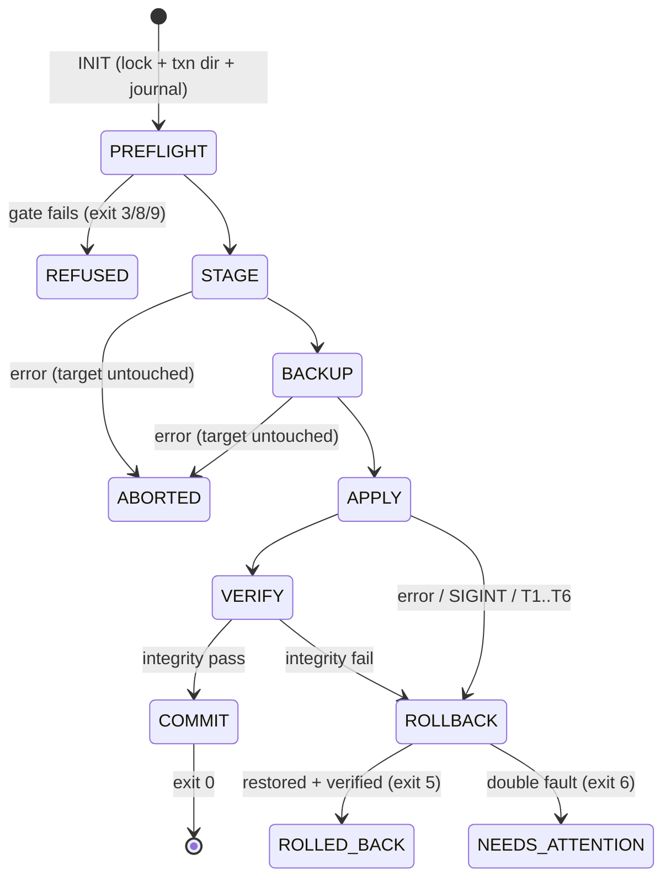

# Talaria — Binding Technical Architecture (v1)

Status: **BINDING**. Implements `docs/design/SPEC.md` (requirement IDs cited as R-…, decisions as
D-…). Research citations use the proposal shorthand (`state §`, `skills §`, `cron §`, `integ §`,
`install §`, `backup`, `digest`, `comp`) → `docs/research/*.md`. Every engine section cites the
research facts it encodes so an implementer never re-derives them.

Runtime floor: Python 3.9, stdlib only for the mandatory core (constraint 1–2). Optional:
`cryptography` (vault — both Scrypt and AESGCM from it, one probe, D12). Dev-only: pytest,
Playwright, vermin.

---

## 1. Package layout

```
talaria/                      # import package; PyPI dist "talaria-migration"; console script "talaria"
  __init__.py                 # __version__, BUNDLE_SCHEMA_VERSION=1, HERMES_KNOWLEDGE stamp
  __main__.py                 # 2.7-parseable floor stub (no f-strings) -> cli.main()   [R-XPLAT-09]
  cli.py                      # argparse tree, exit-code mapping (§14), --json plumbing
  wizard_cli.py               # numbered-prompt wizard (S0-S4/T1-T4 parity)             [R-CLI-03]
  errors.py                   # TAL registry, TalariaError(code, ...), F/PF aliases     [D4]
  events.py                   # ndjson event records shared by CLI + GUI job engine     [D28]
  platform/
    paths.py                  # long-path \\?\ helper, containment (normcase on win32),
                              # Windows reserved-name/illegal-char rules, rename-map codec
    process.py                # pid_alive(): POSIX os.kill(pid,0); win32 ctypes OpenProcess
    fsprobe.py                # case/NFC-NFD behavior probes, fs-type per OS, disk_usage,
                              # st_dev volume grouping, FAT32 cap check
    winreg_compat.py          # HKCU reads (HERMES_HOME, LongPathsEnabled) — import-guarded
    timeparse.py              # owned RFC3339 parser, TZ (name, offset, dst) compare,
                              # Windows->IANA loader (data/windows_zones.json)
  model/
    artifact.py               # Artifact, FileEntry, Dependency, Verdict, Touchpoint dataclasses
    catalog.py                # artifact-kind catalog (§2.2), EXCLUSION_REGISTRY, coupling rules
    secrets_registry.py       # canonical credential names/keys/patterns (§2.3)
    selection.py              # Selection + coupling engine (pack AND apply narrowing)  [D10]
  engine/
    resolve.py                # HERMES_HOME/root/profile/install-identity resolution (§4.1)
    scan.py                   # walker + classifier + reference chaser (§4)
    provenance.py             # OS-parameterized dir-hash, manifest readers (§5)
    diffs.py                  # skill diff, config-vs-default, SOUL, checkout (§5)
    deps.py                   # dependency extraction + feasibility matrix (§6)
    discover.py               # touchpoint ledger; static + DB mining (§7)
    deepscan.py               # skill generation + hardened ingest (§7.3)
    sqlite_snap.py            # snapshot protocol (§8.2)
    pack.py                   # streaming packer (§8)
    bundle.py                 # bundle reader/writer, hardening, manifest, backup-zip detect (§3)
    vault.py                  # crypto probe + scrypt/HKDF/AES-GCM streaming members (§3.4)
    preflight.py              # PF-01..PF-18 (§9.2)
    plan.py                   # rewrite-plan builder (§9.4)
    rewrite/                  # plan executor + format editors
      json_edit.py            #   JSON-pointer mutation, utf-8-sig + indent=2 fidelity
      dotenv_edit.py          #   line-oriented KEY= editor, keepends
      yaml_edit.py            #   indentation-anchored scalar editor + refuse-list
      sqlite_edit.py          #   parameterized UPDATEs in stage
    apply.py                  # state machine, journal, rollback (§9)
    verify.py                 # integrity (gating) + functional (advisory) (§10)
    checklist.py              # Secrets Handoff + post-restore actions[] (§11.3)
    report.py                 # data model, redaction layer, json/md/html renderers (§11)
  gui/
    server.py                 # hardened http.server (§12)
    jobs.py                   # job engine, event log, cancel (§12.3)
    assets/                   # index.html, app.css, app.js — loaded via importlib.resources
  data/
    windows_zones.json        # CLDR Windows->IANA subset (~140 entries)                [C2-08c]
    tal_registry.json         # TAL code -> message/anchor/aliases
tests/                        # §15
```

Rules: no module imports `tkinter`, `yaml`, or any third-party package at runtime; `vault.py`
is the only module that imports `cryptography`, inside a probe function; `winreg`, `ctypes`
Windows calls, `pwd`/`grp`/`os.chown` are import-guarded per platform (C2-21/22).

## 2. The artifact model

### 2.1 Dataclasses (model/artifact.py)

```python
@dataclass
class FileEntry:
    home_rel: str        # POSIX, relative to the profile ROOT ("" profile => root files)
    size: int
    mode: int            # source mode; applied via clamp table only          [R-BND-07]
    mtime: float
    sha256: str | None   # filled during pack (scan is metadata-only, R-SCAN-06)

@dataclass
class Dependency:
    kind: str            # os|env_var|binary|python_pkg|lazy_feature|node|network|
                         # service|credential_file|artifact_ref|config_key
    name: str
    enforced: bool       # True only for env vars + platforms[] (skills §6)
    detail: dict         # e.g. {"url": ...}, {"job_id": ...}

Verdict = Literal["ok","ok_after_rewrite","action","missing_installable",
                  "impossible","unknown_offline"]                     # P2 §6, D11

@dataclass
class Artifact:
    id: str              # stable: "<kind>@<profile>[/<discriminator>]", e.g. "cron-jobs@coder"
    kind: str            # catalog key (§2.2)
    family: str          # one of the 20 families (§2.2)
    profile: str         # "" = root
    files: list[FileEntry]
    portability: str     # "a"|"b"|"c"    — integ §0 classes; "d" is NOT a class here:
    secrecy: str         # "none"|"credential"|"content"   — D2 two-tier split of (d)
    machine_bound: bool
    default: str         # "on"|"off"|"record_only"|"never"
    provenance: dict     # e.g. {"skill":"stock-modified","evidence":["config-ref"], ...}
    dependencies: list[Dependency]
    feasibility: dict[str, Verdict]   # per target OS: linux|macos|windows|termux
    selected: bool
    couples: list[str]   # coupling-rule ids that touch this artifact
    reasons: list[str]   # citation strings rendered by `talaria why`        [R-CLI-07]
```

Legacy research class "(d)" maps to `secrecy != "none"`; display code renders the letter for
continuity. `default="never"` items are enforced by the EXCLUSION_REGISTRY on both sides.

### 2.2 Artifact-kind catalog (20 families; representative leaf kinds)

Column key: class=portability/secrecy/machine_bound, def=default. All kinds repeat per profile
(state §1.3) unless marked ROOT. Citations are the encoding source.

| Family / kind | Paths (root-relative) | class | def | Encodes |
|---|---|---|---|---|
| **1 identity-memory** soul-md | `SOUL.md` | a/none | on | diff vs `default_soul.py` (install §8) |
| memories-dir | `memories/**` | a/content | on | §-split entries (state §2.1) |
| root-md-set | `MEMORY.md USER.md todo.json system_prompt.md AGENTS.md CLAUDE.md .cursorrules desktop.json` | a/none | on | upstream portable set (state §2.1) |
| skins-themes | `skins/*.yaml dashboard-themes/**` | a/none | on | state §2.1 |
| **2 configuration** config-yaml | `config.yaml` | a+b/none (cred keys stripped) | on | (b) keys + inline (d) keys (state §3); floor `_config_version≥12` |
| active-profile | `active_profile` (ROOT) | a/none | on | re-verify target (state §2.1) |
| mcp-json | `mcp.json` | a+b/none | on | state §2.6 |
| skill-bundles | `skill-bundles/*.yaml` | a/none | on | bundles win over skills (skills §2) |
| hooks-dir | `hooks/**` | a/none | on | user content; executable (state §7; C1 SEC-09) |
| no-bundled-skills | `.no-bundled-skills` | a/none | on-if-present | digest §1 |
| config-debris | `config.yaml.corrupt.*.bak` | c | never | state §2.1 |
| **3 credentials** env-file | `.env` `.op.env` | a/credential | checklist/vault | ~40 secret vars (digest §2); never partial copy (R-SEC-08) |
| auth-stores | `auth.json .anthropic_oauth.json shared/nous_auth.json`(ROOT) | a/credential | checklist/vault | state §2.2 |
| mcp-tokens | `mcp-tokens/**` | a+b/credential | checklist/vault | client.json embeds loopback port (integ §2.2) |
| platform-tokens | `google_*.json slack_tokens.json webhook_subscriptions.json credentials/** google_chat_user_*` | a/credential | checklist/vault | state §2.2 |
| memory-provider-keys | `honcho.json mem0.json hindsight/config.json byterover/**` | a/credential | checklist/vault | state §2.2 |
| proxy-key | `proxy/` key only | a/credential | checklist/vault | pid/nonce/audit never (state §2.2) |
| cred-caches+locks | `cache/bws_cache* auth.lock` | c | never | regenerated (state §2.2) |
| **4 skills** skill-dir | `skills/<cat>/<skill>/**` | a/none | on | SKILL.md marker; support-dir rule; per-skill provenance (skills §1, §5) |
| skills-metadata | `.bundled_manifest .usage.json .curator_suppressed .archive/**` | a/none | on (hard-coupled) | losing usage.json freezes curation; suppressed↔archive pair (skills §5, §8) |
| hub-metadata | `.hub/{lock.json,taps.json,audit.log}` | a/none | on | provenance backfill orphaning (skills §4) |
| org-sync | `_org/** .sync_state` | a/none | on-if-present | org baselines (skills §5) |
| skills-machine | `.sync_device_id .termux_bundled_sync_stamp` | c | never | regenerate (skills §2) |
| skills-caches | `.hub/index-cache .hub/quarantine .curator_backups .restore-backups *.bak .usage.json.lock .skills_prompt_snapshot.json` | c | never | skills "Drop" list |
| **5 plugins** plugin-dir | `plugins/<name>/**` (venv/node_modules stripped → reinstall flag) | a/none | on | user plugins; cron providers live here (skills §7; cron §2.3) |
| plugin-data | `plugin-data/<ns>/**` | a/none | on | ns = sha-derived, map via same function (skills §7) |
| **6 automations** cron-jobs | `cron/jobs.json` | a+b/none | on | scrub claims; keep last_run_at + repeat.completed (cron §1.3, §3.1) |
| cron-notepad | `cron/notepad.db` | a/none | on | stateful jobs restart without it (cron §3.3) |
| cron-suggestions | `cron/suggestions.json` | a/none | on | dismissal latches (cron §1.2) |
| cron-output | `cron/output/**` | a/content | on | context_from + monitor baseline (cron §1.2, §7) |
| cron-executions | `cron/executions.db` | a/none | off | audit only; drop non-terminal rows (cron §3.2) |
| scripts-dir | `scripts/**` | a+b/none | on (coupled to jobs) | hard dependency outside cron/ (cron §5) |
| cron-runtime | `cron/ticker_* .tick.lock .jobs.lock usage_audit.jsonl inflight_* cron.pid` | c | never | machine liveness (cron §1.2) |
| **7 conversations-history** state-db | `state.db` | a/content | on | snapshot; cwd columns machine-specific (state §2.3) |
| aux-dbs | `response_store.db memory_store.db verification_evidence.db retaindb_queue.db gateway/discord_message_recovery.db` | a/content | on | state §2.3 |
| sessions-legacy | `sessions/** session-exports/**` | a/content | on | state §2.4 |
| forensic | `state-snapshots/ moa-traces/ spawn-trees/` | a/content | off | state §2.4 |
| checkpoints | `checkpoints/store/**` | c | never | sha256(abs_path) keys unrecoverable (state §2.4) |
| **8 boards-projects** kanban | `kanban.db`(ROOT) `kanban/boards/**` | a+b/none | on | ROOT-level trap (state §10.9) |
| projects-db | `projects.db` | a+b/none | on | path fields (state §7) |
| **9 platforms-messaging** pairing-stores | `pairing/** platforms/pairing/**` | a/content | on | dual-layout merge (integ §1.3, §0) |
| channel-routing | `channel_directory.json channel_aliases.json sticker_cache.json <platform>_threads.json feishu_*.json` | a/none | on | state §2.7 |
| whatsapp-session | `whatsapp/session/** platforms/whatsapp/session/**` | c/credential | **never (v1, D23)** | device-slot fight (integ §1.2) |
| matrix-store / weixin / signal-cli / chrome-debug | various (+outside-home) | c/credential | never (v1, D23) | integ §1.2, §5 |
| bridge-runtime | `scripts/whatsapp-bridge/node_modules photon/sidecar` | c | record_only | npm install on target (integ §1.2) |
| gateway-runtime | `gateway_state.json gateway.pid gateway.lock processes.json .clean_shutdown .restart_* gateway/dead_targets.json gateway/restart_loop.json pending_messages/ runtime/` | c | never | NS-508 (state §2.7) |
| **10 mcp** mcp-server-entry | per `mcp_servers.<name>` in config | a\|b\|c per recipe | on | url vs command; ${VAR} portable (integ §2.4, §2.1) |
| mcp-installs | `mcp-installs/**` | c | never | reinstall via `hermes mcp install` (integ §2.3) |
| **11 providers** provider-config | config `providers.* model.*` | a+b/none | on | localhost base_url (b/c) (integ §3) |
| provider-caches | `cache/model_catalog.json cache/local_endpoint_probes.json …` | c | never | integ §3 |
| cloud-auth-foreign | `~/.aws` GCP ADC Entra `~/.claude ~/.codex ~/.qwen` gh | c/credential | record_only | foreign-owned, checklist reauth (state §2.2, §9) |
| **12 browser** browser-config | config `browser.*` + backend keys | a/none(+cred keys) | on | integ §5 |
| camofox-identity | derived uuid5 pin | special | on | silent login loss otherwise (integ §5) |
| **13 dashboard-observability** dashboard-config | config `dashboard.*` | a+b/none (+cred) | on | public_url (b); basic_auth secret credential (integ §4) |
| hooks-outbound | config `hooks.outbound` | a/none | on | secret_env resolution check (integ §6) |
| monitoring-config | config `monitoring.*` | a/none | on | install_id keep default (integ §6) |
| telemetry-metrics | `telemetry/shared_metrics/` | c | never | integ §6 |
| **14 code-runtime** (record_only family) | git ref/dirty patch/untracked, `.install_method`, version triple, `.hermes_build_sha`, lazy features | — | record_only | install §4, §9; never pack checkout/venv/node/bin (state §2.9) |
| **15 os-integration** (record_only) | systemd/launchd/schtasks/.vbs/.desktop/HKCU/shims/wrappers | c | record_only → regenerate | units bake abs paths (integ §1.4) |
| **16 external-state** memory-provider-dirs | `~/.honcho ~/.hindsight ~/.openviking/ovcli.conf` | a/content | on via `payload/external/` | backup_paths precedent (state §2.2, §9); D16 allowlist |
| external-skill-dirs | `skills.external_dirs[]` trees | a+b/none | on, re-homed by default | D16/C2-20 |
| **17 desktop-app** desktop-jsons | Electron userData `connection.json active-profile.json updates.json` | a+b/none | on | install §5 |
| desktop-machine | `desktop-installation.json window-state.json` | c | never | machine identity (install §5) |
| **18 managed-scope** | `/etc/hermes/*` `.managed` | c | never (+refuse target) | state §8 |
| **19 runtime-ephemera** | `logs/** cache/** image_cache/ audio_cache/ tmp/ .hermes_history .update_check .backup.lock backups/ .talaria/` etc. | c | never | state §2.8; C2-25 self-exclusion |
| **20 unrecognized** | anything unmatched | scan-gated (D9) | on\|record_only\|credential | comp W16; C1 SEC-03 |

### 2.3 Canonical secret sources (model/secrets_registry.py)

Seeds (R-SEC-02): `agent/file_safety.py:28-71,327-338,354-375`;
`gateway/platforms/base.py:1379-1413` `_ROOT_CREDENTIAL_FILES/_DIRS`;
`hermes_cli/backup.py:132` `_SECRET_FILE_NAMES`; `hermes_cli/web_server.py:1798-1826`
(+`.git-credentials`) — all transcribed into the registry with citations (state §2.2; integ §0).
Inline config credential keys per D29/SEC-04. Content patterns (R-SCAN-10): PEM headers, `AKIA`,
`sk-`, `xox[bps]-`, `ghp_`, JWT `eyJ` shape, high-entropy `KEY=` lines. Never-registry (D16 +
SEC-15.1): `~/.ssh ~/.gnupg ~/.aws ~/.config/autostart` shell rc files, `/etc/**`, foreign
credential stores, anything outside `$HOME`.

### 2.4 Coupling rules (model/catalog.py; engine in selection.py, runs at pack AND apply — D10)

From P2 §4.3, verbatim membership: any skill → `.bundled_manifest` + `.usage.json` (hard);
`.curator_suppressed` ↔ `.archive/` (hard both ways); job with `script` → `scripts/<script>`
(hard); job with `context_from` → referenced jobs + output dirs (hard); job `monitor_state` →
`output/<id>/monitor_last_output.txt` (hard); `cron.provider != builtin` → `plugins/<provider>/`
(hard); job `skills:[x]` → skill x (soft); hub-modified skill → `.hub/lock.json` (hard); MCP
`${VAR}` → checklist var (soft); skill required env vars → checklist vars (soft);
`memory.provider` → external dir + provider config (hard). Ordering via `graphlib.TopologicalSorter`
(3.9 stdlib). Violated hard couple ⇒ exit 3 naming the couple id.

## 3. Bundle format (`.hermespack`)

### 3.1 Zip layout (zip64 always; R-PACK-01)

```
manifest.json                    # FIRST member, STORED (uncompressed) for cheap reads
payload/home/<root-relative>     # POSIX separators; profiles under payload/home/profiles/<n>/…
payload/external/home/<home-rel> # _external precedent, home-relative only (state §2.2)
meta/checkout.patch              # dirty-diff patch (R-DIFF-06)
meta/provenance.json             # per-skill tags + diffs summary
meta/deps.json                   # dependency graph + predictive verdicts
meta/touchpoints.json            # discovery ledger (redacted tier applied)
meta/report-capture.json         # the capture run's report.json
vault/<seq>                      # encrypted members when vault present (§3.4)
```

Unrecognized payload lives at its real `payload/home/...` path; the manifest `kind:"unrecognized"`
flag is what gates placement (D9) — no separate zone.

### 3.2 manifest.json (schema_version 1)

```jsonc
{ // ETERNAL HEADER — frozen forever (P4 §10.2, R-BND-02)
  "schema_version": 1,
  "min_reader_tool_version": "1.0.0",
  "created_by_tool_version": "1.0.0",
  "created_at": "2026-08-15T18:42:03Z",
  "source": {
    "hermes_version":"0.20.1","release_date":"2026.8.13","git_head":"cb47f59ff",
    "git_tag":"v2026.8.13","git_dirty":true,"build_sha":null,"install_method":"git",
    "config_version":36,"os":"linux","arch":"x86_64","layout_family":"posix",
    "hermes_home":"/home/alice/.hermes","home":"/home/alice","user":"alice","hostname":"atlas",
    "python":"3.11.9","tz":{"name":"Europe/Paris","utc_offset_min":120,"dst":true},
    "lazy_features":["provider.anthropic","search.exa"],"capture_mode":"live",
    "hash_semantics":{"separator":"posix","collation":"posix"}          // D14 / C2-01
  },
  // schema-1 body (additive-only within the major; readers ignore unknown keys)
  "bundle_id":"7f3a…16hex", "intent":"replace", "profiles":["","coder"],
  "counts":{"files":1412,"artifacts":74}, "bytes":{"payload":3628391212},
  "artifacts":[ { "id":"cron-jobs@","kind":"cron-jobs","family":"automations","profile":"",
      "class":"a","secrecy":"none","machine_bound":false,"default":"on","selected":true,
      "provenance":{...},"deps":[...],
      "files":[{"member":"payload/home/cron/jobs.json","home_rel":"cron/jobs.json",
                "size":18123,"sha256":"…","mode":384,"mtime":1765801323.0}] } ],
  "selection":{"preset":"everything-portable","overrides":[...]},        // R-PACK-05
  "rewrite_anchors":{"source_home":"/home/alice","source_hermes_home":"/home/alice/.hermes",
                     "user":"alice","sep":"/"},
  "predictive":{"windows":{"illegal_names":[...],"collisions":[...],"verdicts":[...]}},
  "camofox_user_id":"uuid5(...)",                                        // integ §5 pin value
  "checklist":{"items":[{"name":"OPENAI_API_KEY","used_by":["model"],"url":"…"}]}, // names only
  "unrecognized":[{"member":"payload/home/notes-old.txt","gate":"clean-text"}],
  "vault":{"present":false},                                             // §3.4 when true
  "compat":{"config_floor":12,"notes":[]}
}
```

Caps before parse (R-BND-07): manifest ≤ 64 MiB, ≤ 2^20 file entries. Per-file SHA-256 lives in
`artifacts[].files[]`; that table IS the checksum scheme (constraint 5). Payload members carry the
manifest-recorded mode but appliers clamp to {0600,0644,0700,0755} and force credential files 0600
(state §10.10).

### 3.3 Reader hardening (engine/bundle.py — one code path for STAGE, inspect, salvage; R-BND-07)

In order: (1) parse eternal header; refuse schema > N (exit 9, F08/TAL-3xx); (2) manifest↔zip
bijection; (3) member-name legality: reject absolute, `..` segment, backslash, drive letter, UNC,
reserved device names, trailing dot/space (C2-04/14); (4) duplicate detection post-NFC+casefold
(+NFD pass) — collisions refuse-with-rename-plan when the destination fs probe says insensitive
(C2-03); (5) streamed extraction hashes every member against the manifest and enforces per-member
size = manifest size + slack and total cap (bombs; C1 SEC-08); (6) symlink members rejected;
(7) `inspect --extract -o DIR` applies the same containment relative to DIR.

### 3.4 Vault (engine/vault.py; D12, R-SEC-04/05)

Capability probe: `from cryptography.hazmat.primitives.kdf.scrypt import Scrypt` +
`...aead.AESGCM` — one probe, one honest refusal (F18/TAL-2xx). Derivation: scrypt(N=2^17, r=8,
p=1, salt=16 B `secrets.token_bytes`, dklen=64; params stored in `manifest.vault.kdf`) → HKDF-SHA256
labels `"talaria-enc"` (AES-256-GCM key) and `"talaria-mac"` (HMAC key). Member framing
(`vault/<seq>`): magic `TLV1` · 8-byte random nonce_prefix · chunks of `chunk_bytes` (8 MiB):
`[u32 len][ciphertext||16B tag]`, nonce = prefix ‖ BE32(chunk_index); AAD =
`bundle_id|schema_version|home_rel|chunk_index|last_flag`. Manifest records per member:
`home_rel`, `plain_sha256`, `plain_size`, `member`, and `manifest.vault.mac` = HMAC-SHA256 over
the canonicalized vault section (SEC-11 anti-transplant). Scope: `"credentials"` (default with
`--vault`) or `"everything"` (lock-everything, adds SENSITIVE-CONTENT members). Member ceiling
2^20 asserted. Passphrase: GUI POST body / CLI prompt / `--vault-passphrase-file`; empty refused;
never argv/URL/log.

### 3.5 Plain `hermes backup` zip detection (R-BND-05)

A zip with no `manifest.json` (or one lacking the eternal header) whose members — after
single-prefix stripping mirroring `backup.py:828-849` — contain ≥2 of the upstream validation
markers `{config.yaml, .env, state.db}` (`backup.py:811`) is classified `hermes-backup-zip`.
v1: `inspect` names it, prints its top-level shape, and directs to `hermes import` on the target
(D22). v1.1 (R-BND-08): degraded classification + apply with "no provenance / no preflight
intelligence" banners; strips `__MACOSX/`, tolerates cp437 names (C2-14).

## 4. Scanner engine (engine/resolve.py + scan.py)

### 4.1 Root & identity resolution (R-SCAN-01/08)

Encodes exactly: HERMES_HOME precedence env → HKCU `Environment\HERMES_HOME` (Windows GUI apps
miss post-login setx — install §4 traps) → platform defaults (`hermes_constants.py:53-59`:
`~/.hermes` POSIX/macOS/Termux, `%LOCALAPPDATA%\hermes` else `~\AppData\Local\hermes` Windows;
`/opt/data` Docker). Profile root vs home: `env_path.parent.name == "profiles"` detection +
`active_profile` sticky file (`hermes_constants.py:173-210`; state §1.3). Install root walk:
`<home>/hermes-agent`, then `/usr/local/lib/hermes-agent`, `/opt/hermes`; confirm via
`hermes_cli/__init__.py` + `pyproject.toml` + `.git` (install §4). Install method = the 7-step
algorithm of `config.py:412-513` transcribed. Version: parse `__version__` with
`re.search(r'__version__\s*=\s*"([^"]+)"')` (install §4); git via `git -C <root> rev-parse` /
`status --porcelain` / stash list; `.hermes_build_sha` when present. Lazy features: run
`<install>/venv/bin/python -c "import json,tools.lazy_deps as l;print(json.dumps(sorted(l.active_features())))"`
— enrichment only, absent venv ⇒ `lazy_features: null` + report note (install §9).

### 4.2 Walk & classify (R-SCAN-02..06, R-SCAN-10)

`os.scandir` recursion; EXCLUSION_REGISTRY globs checked **before** descent (the 426,543-file
incident — backup; C2-10); `hermes-agent` pruned at ROOT depth only (`skills/**/hermes-agent/` is
data — state §10.2); `entry.is_symlink()` ⇒ recorded, never followed (state §10.3). Dual-layout
merge via a `get_hermes_dir(new, old)` mirror: non-empty legacy wins, empty legacy ignored
(#27602; integ §0). Classification: longest-match against catalog path rules per profile subtree;
residue → unrecognized pipeline (SEC-03 gates: variant-name rules → content scan ≤1 MiB text →
else record_only). Live-install etiquette: `.backup.lock` fresh ⇒ wait-and-poll banner;
`.hermes-update-in-progress` < 20 min ⇒ refuse capture (install §3; P3 §6.1).

### 4.3 Reference chaser (R-SCAN-07)

Structured extraction only (never grep of source code): config machine-specific keys
(`terminal.cwd`, `mcp_servers[].command/args/cwd/url/ssl_verify/client_cert/client_key`, `lsp.*`,
`browser.*`, `prefill_messages_file`, `model.base_url`, `dashboard.public_url`,
`skills.external_dirs[]`, `cron.chronos.callback_url` — state §7; P3 §8.4); cron jobs (`script`,
`monitor_script`, `workdir`, absolute `skills`, `context_from`, `monitor_url` — cron §4–5);
plugin `plugin.yaml requires_env`; memory-provider externals (`~/.honcho`, `~/.hindsight`,
`~/.openviking/ovcli.conf` — state §2.2). Each reference: lstat probe → `{exists, inside_home,
class, verdict}` → touchpoint ledger (§7).

## 5. Diff / provenance engine (engine/provenance.py + diffs.py)

- **Dir-hash** mirrors `_dir_hash()` (`tools/skills_sync.py:254-265`): MD5 over sorted rglob of
  `relpath + bytes` — **parameterized** `dir_hash(root, sep, collation)` where sep ∈ {posix,nt},
  collation ∈ {posix (byte sort), nt (casefolded Path sort)}; the manifest records the semantics
  used (D14/C2-01; upstream fixed this class only in the hub digest, issue #62310 — skills §5).
- **Six provenance tags** exactly as upstream derives them (skills §5): in `.bundled_manifest` ⇒
  bundled (hash equal → stock-pristine, else stock-modified; v1 hashless entries not tracked);
  in `.hub/lock.json` ⇒ hub-installed; under `_org` baseline ⇒ org; `.usage.json
  created_by=="agent"` ⇒ agent-created; else user-created. The three digest schemes
  (MD5 dir-hash / lock.json `sha256:<16hex>` / org fingerprints) are never cross-compared
  (R-DIFF-07 guard is a unit test).
- **Cross-OS rebaseline** (apply-side, in stage): for every skill the manifest marks
  stock-pristine, rewrite its `.bundled_manifest` line with a hash recomputed under **target**
  semantics; modified skills untouched (any mismatch still reads "modified" — correct).
  `_org` baselines are flagged, never rewritten (C2-01.2).
- **Skill diff** mirrors `diff_bundled_skill` semantics: per-file unified diff via `difflib`,
  status modified/added/removed/binary (NUL sniff — skills §5).
- **Config diff**: extract `DEFAULT_CONFIG` by shelling the source venv
  (`python -c "import json; from hermes_cli.config_defaults import DEFAULT_CONFIG; …"`), deep-diff
  key trees, mask credential-key values; no venv ⇒ status `unknown_no_venv` (R-DIFF-04).
- **SOUL diff**: compare against the packaged copy of the default persona text (`default_soul.py`
  must match or SOUL is treated never-customized — install §8).
- **Checkout diff**: `git status --porcelain` + `git diff` patch + untracked list recorded to
  `meta/checkout.patch`; replay on target is a checklist-offered action (autostash interaction
  documented — install §3).

## 6. Dependency engine (engine/deps.py)

Extraction sources (R-DEPS-01), each with its authority: skill frontmatter parsed with a
CSafeLoader-equivalent stdlib mini-parser? — **No**: frontmatter is read via the same naive
`key: value` fallback upstream uses on YAML failure (`agent/skill_utils.py:174-220`) plus a
bracketed-list reader for the enforced fields; only `required_environment_variables` (resolved
`.env`-then-environ — `tools/skills_tool.py:340-405,500-505`), `platforms[]` (hard gate via
PLATFORM_MAP; Termux accepts linux — skills §1), `environments[]`, `prerequisites.*`,
`dependencies[]`, `setup.collect_secrets`, `metadata.hermes.config[]` are consumed. Cron:
interpreter by extension (`.sh` needs bash; Windows hard error — `cron/scheduler.py:2985-2999`),
croniter for `kind:"cron"` (cron §4), delivery platform vs `_KNOWN_DELIVERY_PLATFORMS` + home-
channel env vars (cron §4), model/provider snapshot drift (`cron.model_drift_guard` fails closed
`[drift_skip]`), `workdir` existence, `context_from` closure, MCP toolset refs. MCP recipe steps
1–8 of integ §2.4 implemented literally (url vs command; npx→Node, uvx→uv, docker→daemon; path
under mcp-installs ⇒ reinstall; `${VAR}` cross-check; literal abs path / localhost flags; oauth ⇒
token presence ⇒ reauth-maybe; plugin portable servers included). Providers: env-key inventory +
localhost base_urls (integ §3). Lazy features list drives target re-ensure (install §9).

Feasibility evaluation: **predictive** `evaluate(bundle, target_os)` uses static OS knowledge
tables only (works on bare 3.9, offline — A11); **live** `evaluate_here()` probes PATH binaries,
python/node presence, env vars, filesystem, TZ, LongPathsEnabled. Output cells carry
`{verdict, evidence(file+locator), remediation(command)}`; who-acts mapping per SPEC §7.3.

## 7. Discovery system (engine/discover.py + deepscan.py)

Ledger entry: `{path|url, provenance[], confidence, verdict, first_seen}` (P3 §10). Layer 1 =
§4.3 chaser. Layer 2 (read-only): distinct `sessions.cwd`/`git_repo_root` via SQL on the
**snapshot** (mirrors `hermes_state_portability.py:41-68` — state §2.3), `.usage.json`
last_used_at (active vs dormant skills — skills §5), cron `output/` recency. Layer 3 Deep-Scan:

- `deepscan generate` writes `talaria-deep-scan/SKILL.md` + `references/output-schema.md`
  instructing the agent to inventory tools/paths/services/credential **names** (never values) into
  `talaria-deepscan-<nonce>.json` (nonce = 16 hex minted per generate; embedded in the skill).
- `deepscan ingest <file>`: reads exactly the nonce-named file (no glob — SEC-15), enforces
  ≤1 MiB, JSON schema, nonce match; every string is value-scrubbed with the secrets patterns;
  each path lstat-probed only. Gate order (SEC-15.1): never-registry FIRST — denylisted or
  outside-$HOME candidates are refused into the advisory appendix ("agent suggested a sensitive
  system path — refused"); survivors become user-optional candidates tagged
  `agent-reported/verified`; unprobeable ⇒ advisory appendix; matches to Layer-1/2 ⇒ tag-union
  corroboration; Layer-1/2 findings the agent missed ⇒ `agent-blind`. Ingest can never mutate
  selection, exclusions, or scrubs (R-DISC-05; asserted by A12).

## 8. Packer (engine/pack.py + sqlite_snap.py)

Pipeline SCAN → SNAPSHOT → PACK → SELF-VERIFY → PUBLISH (P3 §2.5). Mechanics:

- **Streaming**: each payload file read once in 1 MiB chunks through `zipfile.ZipFile.open(name,
  "w")` (`allowZip64=True`), SHA-256 updated in the same pass (C2-10); no separate hash pass
  exists in the codebase (lint-guarded).
- **SQLite protocol** (`sqlite_snap.py`; state §2.3, backup precedent, C2-11):
  `sqlite3.connect(f"file:{src}?mode=ro", uri=True)` → `src.backup(dst_conn, pages=-1)`
  (single-pass; stepped backup livelocks on hot 30 GB DBs) → fail closed on exception; sidecars
  (`-wal/-shm/-journal`) never packed (torn-restore hazard); zeroed-file detection first (header
  magic + zero-page scan — #68474); integrity: full `PRAGMA integrity_check` < 2 GiB else O(1)
  header+schema probe (30 GB state.db exists — state §10.6); snapshot temp files created in the
  output directory, never /tmp (tmpfs truncation — state §10.5); `busy_timeout=5000`, 3 retries
  with backoff on `database is locked`/hot-WAL, then artifact FAIL + quiesce guidance (F03);
  per-DB soft cap 8 GiB (`--db-cap`) requiring confirmation above; recorded pragmas
  (page_size/page_count/journal_mode/schema_version) in the manifest.
- **Prechecks** (R-PACK-07): `shutil.disk_usage` on the destination volume vs estimate; fs-type
  via §fsprobe — FAT32/exFAT + estimate > 4 GiB ⇒ hard warn at 0%, not 99%.
- **Atomic publish**: `<name>.hermespack.partial` opened 0600 → SELF-VERIFY re-reads every member
  vs manifest → `os.replace` (backup precedent). Crash ⇒ only a `.partial` remains; next run
  offers deletion. Capture never resumes — it restarts (source is read-only, restart always safe).
- **Registry belt**: after writing, assert no member matches a `capture|both`-scope exclusion
  (R-PACK-06).

## 9. Applier (engine/apply.py)

### 9.1 State machine (P3 §2.1, adopted verbatim; D25 trims resume)



INIT: txn id ≤12 chars; `$HERMES_HOME/.talaria/txn/<id>/{journal.jsonl,s/,b/}` (short names —
C2-05), `.talaria/` 0700 with a README marker ("Talaria transaction area — safe to ignore;
upstream `hermes backup` may zip it" — C2-25), lock `O_CREAT|O_EXCL` with `pid\nstarted_at`,
staleness via §platform.process probe (never `os.kill(pid,0)` on win32 — C2-02). Stage roots are
**per destination volume** (`st_dev` of each final parent): home volume stages under `s/`;
external volumes get `<dest_parent>/.talaria.stage.<id>/`; fallback copy+fsync+`os.replace`
within the destination dir; strategy journaled per op (C2-06).

### 9.2 Preflight gates (engine/preflight.py; R-APPLY-04)

| PF | Check (source) | FAIL behavior |
|---|---|---|
| PF-01 | Gateway not running: pid file + platform-correct liveness + port probe (C2-02) | refuse; print `hermes gateway stop` |
| PF-02 | No `hermes backup` in flight (`.backup.lock` fresh — backup) | refuse; retry guidance |
| PF-03 | No update in flight (`.hermes-update-in-progress` < 20 min — install §3) | refuse |
| PF-04 | Disk ≥ payload × 2.2 per stage volume (install §3 precedent ×1.2 for one copy) | refuse |
| PF-05 | Managed (`.managed`/HERMES_MANAGED) or in-container target (state §8) | refuse + guidance |
| PF-06 | Version-skew class (§9.6) | refuse BLOCKED classes (exit 8) |
| PF-07 | Hermes present/healthy (`hermes --version` — install §10) | WARN absent ⇒ state-only mode + pinned install command |
| PF-08 | WAL-hostile fs (NFS/SMB/FUSE/WSL1) via named detection (state §2.3; C2-23) | WARN + journal-mode note |
| PF-09 | One-shots past 120 s grace (cron §6) | WARN + decision list |
| PF-10 | TZ: recorded (name, offset, dst) vs target, offset-based (C2-08) | WARN + offer `timezone:` pin (Windows→IANA table) |
| PF-11 | Lived-in target ⇒ conflict preview + policy (D8) | interactive/flag |
| PF-12 | Bundle schema supported | refuse (exit 9) |
| PF-13 | Executable-content summary (plugins/hooks/scripts/MCP stdio) — consent row (SEC-09) | consent gate |
| PF-14 | Windows filename legality ⇒ consented rename map (C2-04) | consent or refuse |
| PF-15 | Case/NFC collision scan + target-fs behavior probe (C2-03) | refuse-with-rename-plan |
| PF-16 | Longest final path vs `LongPathsEnabled` (C2-05) | WARN |
| PF-17 | Unrecognized-files disclosure (D9) | consent row / `--include-unrecognized` |
| PF-18 | Non-allowlisted `_external/` members (D16) | consent-per-path; never-list refuses |

### 9.3 Journal (P3 §2.2 + C2-06 field)

`journal.jsonl`, append-only, `flush()+os.fsync()` **before** the described action; torn final
lines detected by parse failure and truncated on the next run. Records:
`{"seq","ts","event":"state|op.intent|op.done|commit|rollback.begin|rollback.done","op_id",
"kind":"replace_file|create_file|create_dir|replace_tree|chmod|chown|delete_stale|db_place|
rename_map","final","staged","pre_sha","expected_sha","mode","backup","strategy":"rename|copy",
"retries":0}`. v1 crash handling: unterminated journal ⇒ offer rollback (walk reverse, restore
`b/` originals via `os.replace`, remove created files/dirs, re-hash vs `pre_sha`; failure ⇒
NEEDS_ATTENTION freeze printing journal/backup paths + per-file commands). Fields already carry
what resume-continue needs (v1.1 — D25). The quick-state floor set (`state.db, config.yaml, .env,
auth.json, cron/jobs.json` — `_QUICK_STATE_FILES`, state §6) is always backed up even when
unselected.

### 9.4 Rewrite engine (engine/plan.py + rewrite/*)

Plan entries: `{op_id, file, format, locator, old, new, rule, status: auto|needs_review|manual,
pre_sha, post_sha}` — computed **on the target** from manifest anchors (source home/user/layout →
target equivalents). Editors (all `splitlines(keepends=True)`, BOM-preserving, dominant-EOL for
insertions — C2-12):

- **JSON** (`jobs.json`, channel maps, plugin state): parse (`utf-8-sig` — cron §1.4) → mutate at
  JSON pointer → dump `indent=2` matching upstream's writer (`cron/jobs.py:1288-1340`). Cron
  specials: absolute `script` → relative to `scripts/` (hard-contained upstream —
  `cron/scheduler.py:2958-2971`); absolute skill refs → names (mirrors
  `referenced_skill_names`/`rewrite_skill_refs` — cron §4); `workdir` remap-or-flag.
- **dotenv**: only lines `KEY=` for an exactly named key; value substring replaced; every other
  byte preserved. URL-valued vars (`SIGNAL_HTTP_URL, HASS_URL, CAMOFOX_URL, N8N_BASE_URL,
  BROWSER_CDP_URL`) are flag-class; `?token=` masked in previews (SEC-12).
- **YAML** (config.yaml): indentation-anchored key-path scalar locator; refuses (→ needs_review
  with manual instructions) on anchors/aliases, block scalars, flow collections on the line,
  merge keys, duplicate keys, tabs (P3 §8.3 + C2-13); replacement scalars single-quoted unless
  plain-safe (deterministic rule; Windows drive paths covered). Validation: venv-assisted
  `yaml.safe_load` tree-compare when a Hermes venv exists; else self-reparse must find the new
  value at the same path or the op reverts to needs_review.
- **SQLite** (stage snapshots only): parameterized UPDATEs in one transaction
  (`sessions.cwd/git_repo_root` prefix remaps — OFF by default, expert opt-in; dangling cwds
  reported instead — state §2.3); row counts journaled; `quick_check` after commit.
- **Never rewritten**: units/plists/tasks/.desktop (regenerated), scripts and skill bodies
  (path hits flagged file:line), binaries (P3 §8.3).

Special ops: pin `browser.camofox.user_id` to the manifest-recorded uuid5 (identity derives from
the absolute state-dir path; unpinned moves silently orphan every browser login —
`tools/browser_camofox_state.py:18-46`, integ §5); inline credential keys **omitted** + checklist
(D29); `dashboard.public_url`, `cron.chronos.callback_url`, `model.base_url` localhost ⇒
flag-class (P3 §8.4). `--yes` never auto-accepts host/URL or credential-file ops (SEC-12).

### 9.5 Both-sides enforcement & scrubs (R-APPLY-06)

One `EXCLUSION_REGISTRY` (`{id, globs, scope: capture|apply|both, reason, citation}`) filters
apply regardless of bundle contents (old archives predate hygiene — backup NS-508 lesson).
Apply-side sweeps stale runtime files already on the target the way container boot does
(`container_boot.py:75,417-418` — state §8). Stage scrubs (journaled): cron `run_claim`/
`fire_claim` → null, `preflight_alerted`/`drift_alerted` dropped (`_machine_id()` is
`hostname:pid`; a stale foreign claim younger than TTL suppresses the first fire —
`cron/jobs.py:2996-3003, 2795-2808`); executions.db non-terminal rows deleted (recovery fails
safe-to-alive on foreign pids — `cron/executions.py:199-233`); desktop installationId regenerated
(install §5). `db_place` op deletes stale sidecars at the final path (backed up) before placing a
snapshot (state §2.3).

### 9.6 Skew classes (P3 §9.2 verbatim)

EXACT proceed · FORWARD-OK proceed + "config migrates forward" note (table-driven migrations,
floor 12 — state §3) · FLOOR-BREACH (`_config_version < 12`) hard WARN mirroring upstream's "run
hermes setup" · BLOCKED-DOWNGRADE refuse exit 8 + pinned `--commit` remediation (install §12) ·
UNKNOWN refuse exit 8 unless `--force-skew` (recorded). Bundle-schema skew: accept ≤ N; newer ⇒
exit 9 "upgrade talaria".

### 9.7 Conflicts (D8)

Policies `keep|overwrite|rename|ask` per artifact at CLI; wizard fixed to
replace-with-safety-copy (the BACKUP phase is the safety copy; "Undo everything" restores it).
Every decision → report `conflicts[]`.

## 10. Verifier (engine/verify.py)

Gating (rollback on failure): re-hash every applied path vs expected post-rewrite hash; DB
`PRAGMA quick_check` size-capped (2 GiB rule — state §10.6); machine-bound absence sweep; legacy
empty-dir shadow audit (#27602). Advisory (never blocks commit in v1 — C3 #14): `hermes --version`
parse ("Hermes Agent vX (date)" — `_startup_fast.py:186`); `hermes doctor` exit + conservatively
parsed sections folded into `actions[]` (digest §3); cron preflight mirror (env vars, provider
keys, delivery, workdir, croniter/bash — `cron/scheduler.py:3695-3725`); secret-mode audit
(0600/0700 POSIX); MCP config re-read. `talaria verify --watch`: poll `cron/ticker_heartbeat`
mtime advancing ⇒ proof-of-life (deliberately unmigrated — cron §1.2; ~60 s expectation, cron §2.1).

## 11. Report generator (engine/report.py + checklist.py)

### 11.1 Data model = report.json schema v1 (P3 §14 adopted; single source for all renderers)

Top-level keys: `schema_version, run{id,tool_version,command,mode,started,finished,exit_code,
txn_id}, source_system, target_system, skew, selection, artifacts[] (status ∈ migrated|rewritten|
renamed|skipped_machine_bound|skipped_policy|skipped_user|conflict_kept|conflict_replaced|error|
needs_action|verified|unrecognized_carried|unrecognized_skipped + stable reason strings),
rewrites[], exclusions[], scrubs[], renames[], conflicts[], touchpoints[], checks[], failures[],
actions[], hazards[], journal, backup, redaction{mode}`. Status vocabulary + the 13
anti-overclaiming rules adopted from claw-migrate (install §7). Output layout:
`$HERMES_HOME/migration/talaria/<ts>/{report.json, summary.md, report.html, checklist.json}`
(0600 — SEC-17); capture-side beside the bundle + `<bundle>.checklist.html` (P4 M6).

### 11.2 Redaction layer (SEC-17)

One transform over the data model **before any renderer**: username/home-path masking, secret-
pattern masking (same registry), URL `?token=` masking — identical result in HTML prose, JSON
appendix, and CLI rendering; belt: pattern pass over the final artifact. Modes: `default`
(redacted), `--no-redact`, `--redact-strict` (drops the SOUL quote). HTML: single file, inline
CSS, `<meta http-equiv="Content-Security-Policy" content="default-src 'none'; style-src
'unsafe-inline'">`, every foreign string escaped (SEC-16), print CSS (D26), light/dark,
`<script type="application/json">` appendix.

### 11.3 Checklists

Secrets Handoff: from `.env` + auth stores + inline config keys + per-skill
`required_environment_variables` (+`setup.collect_secrets.provider_url` — skills §1/§6); names +
where-used + provider URL, never values. Post-restore `actions[]` keyed to findings with exact
commands: `hermes gateway install`, `hermes whatsapp`, `hermes mcp reauth --all`,
`hermes gateway enroll`, `hermes dashboard register`, `npm install` (bridge),
`hermes mcp install official/n8n`, `hermes doctor` (integ §8; digest §5.6). Checklist state
persists in `checklist.json` (state only, never values — SEC-06).

## 12. GUI architecture (gui/)

### 12.1 Server (R-GUI-01/02; D15)

`ThreadingHTTPServer` bound to `("127.0.0.1", 0)` (port printed literally — C2-09). Bootstrap:
launch URL `http://127.0.0.1:<port>/#t=<bootstrap>`; the page immediately POSTs
`/api/session {bootstrap}` → `{token}` (≥128-bit `secrets.token_urlsafe`), bootstrap invalidated
on first use; thereafter every `/api/*` request requires `X-Talaria-Token` (constant-time
compare). Request filter (before routing): `Host` ∈ {`127.0.0.1:<port>`, `localhost:<port>`,
`[::1]:<port>`} else 403; `Origin` (when present) same set else 403; responses carry
`Referrer-Policy: no-referrer`, `X-Frame-Options: DENY`, `X-Content-Type-Options: nosniff`,
`CSP default-src 'self'`. Secrets only in POST bodies; access log = method+path only. One active
session; token-less second visitor gets a static "session in use" page. `POST /api/shutdown` +
idle timeout (30 min) + auto-shutdown when the wizard completes.

### 12.2 Endpoints

`POST /api/session` · `GET /api/state` (wizard model) · `POST /api/jobs {kind: scan|pack|
preflight|apply|rollback|verify|deepscan-generate, args}` → `{job_id}` · `GET /api/events?after=N`
(poll, ≤500 events/batch — D28) · `POST /api/jobs/<id>/cancel` · `POST /api/selection` (Customize
drawer tri-state updates; coupling engine round-trips) · `POST /api/secrets` (paste-back →
create-exclusive 0600 `.env` write, journaled micro-op with backup, EOL-preserving — C2-21) ·
`POST /api/vault-passphrase` · `GET /api/report/<ts>` · `GET /` + static assets via
`importlib.resources.files("talaria.gui").joinpath("assets")` (zip-safe — C2-09). No filesystem
paths accepted from the client except through vetted pickers (server-enumerated).

### 12.3 Job engine (gui/jobs.py)

One worker thread; queue depth 1 (a second job while one runs ⇒ 409). Jobs emit the same event
records `events.py` defines for `--progress ndjson`: `{seq, ts, kind: phase|item|progress|warn|
error|done, phase, detail, bytes_done, bytes_total}` — byte-weighted bars for pack/apply, item
narration for scan (P1 §14). Cancel sets a flag checked between ops; apply cancel ⇒ rollback path.

### 12.4 Screen inventory

S0 detect/greet · S1 scan narrative · S2 review (6 categories + Won't-travel + Deep-Scan card) ·
S3 keys mode (+vault/lock-everything) · S4 pack/boarding pass/transfer+retire coaching ·
T1 open bundle/provenance card/install-poll · T2 preflight who-acts (+PF-13/17/18 consent rows) ·
T3 apply stages · T4 finish (checklist, paste-back, old-machine gate, heartbeat, undo) ·
Customize drawer (tri-state tree, consequence sentences, badges, search) · Inspector (read-only
bundle view) · Report viewer. GUI strings all pass the escaper (SEC-16).

## 13. CLI surface (final v1 tree)

```
talaria                                  # wizard (numbered prompts; GUI parity)
talaria scan      [--home P] [--all-profiles] [--json]
talaria diff      skills [NAME] | config | checkout   [--json]
talaria deps      [--target-os linux|macos|windows|termux]... [--live] [--json]
talaria pack      [-o OUT] [--preset everything-portable|essentials|identity-only]
                  [--include GLOB]... [--exclude GLOB]... [--selection FILE]
                  [--intent replace|clone] [--vault [--lock-everything]
                  [--vault-passphrase-file F]] [--profile NAME]...
                  [--require-quiesced] [--db-cap GiB] [--yes] [--json] [--progress ndjson]
talaria inspect   BUNDLE [--verify] [--list] [--cat MEMBER] [--extract GLOB -o DIR]
                  [--deps --target-os X] [--checklist] [--salvage] [--json]
talaria preflight BUNDLE [--home P] [--json]
talaria apply     BUNDLE [--dry-run] [--emit-plan F] [--plan F]
                  [--conflict keep|overwrite|rename|ask] [--only ID]... [--skip ID]...
                  [--intent replace|clone] [--include-unrecognized] [--accept-url-changes]
                  [--force-skew] [--yes] [--json] [--progress ndjson]
talaria verify    [--home P] [--last | --report F] [--watch] [--json]
talaria rollback  [--txn ID] [--json]
talaria report    [--last] [--format json|md|html] [-o F] [--no-redact|--redact-strict]
talaria checklist BUNDLE | --home P   [-o F]
talaria deepscan  generate [-o DIR] | ingest FILE   [--json]
talaria why       PATH [--json]
talaria gui       [--port N] [--no-browser]
```

Globals: `--home`, `--quiet/--verbose`, `--no-color`, `--non-interactive`. Selection files and
all records are JSON (no `tomllib` on 3.9 — P2 §16). Deferred v1.1: `--resume`,
`--strict-verify`/`commit`, `decommission`, `presets save`, config-file jobs, `convert` (D21).

## 14. Error & exit-code model

Exit codes (P3 §13 verbatim — D3): `0` success · `1` internal error · `2` usage · `3` refused,
nothing modified · `4` capture integrity failure, no bundle published · `5` apply failed, rollback
succeeded · `6` rollback incomplete NEEDS_ATTENTION · `7` reserved (v1.1 strict-verify) ·
`8` compatibility/skew block · `9` bundle unreadable/corrupt/schema unsupported. Guarantee: only
5/6/7 imply the target was touched; 6 is the only unrestored state, and the pre-apply backup
still exists.

TAL registry (`data/tal_registry.json`; D4): bands `TAL-1xx` scan/detect · `2xx` capture/pack ·
`3xx` bundle/transfer/inspect · `4xx` preflight/compat · `5xx` apply/rollback · `6xx`
verify/post-apply · `7xx` GUI/server · `8xx` internal. Each entry:
`{code, title, fix_line, doc_anchor, aliases[]}` where aliases carry P3's F/PF ids and P1's
mnemonics (e.g. `TAL-503 ← F13`, `TAL-401 ← PF-01/F09`, `TAL-601 ← WA-DEVICE-LINK`). Release
gate: no user-visible error path without a TAL code (P4 §6/§12). Report `failures[]` records TAL
codes + aliases. Report JSON schema: §11.1.

## 15. Test strategy

### 15.1 Layers

1. **Unit** per engine module (hash semantics matrix, editors' byte-fidelity, coupling engine,
   secret classifier, RFC3339/TZ, rename maps, vault framing round-trip with `cryptography`
   present and refusal without).
2. **Integration**: pack→inspect→preflight→apply→verify round-trips on fixtures; journal
   crash-injection (kill at randomized op seq — A5); conflict matrix; dry-run equivalence
   (dry-run report == execute report modulo mode).
3. **Cross-platform simulation on Linux CI**: `platform/` modules accept an injected facade
   (`sep`, `collation`, `case_insensitive`, `reserved_names`, `max_path`) so Windows/macOS
   semantics — dir-hash collation (C2-01), casefold/NFC collisions (C2-03), reserved-name
   verdicts (C2-04), long-path audit (C2-05) — are exercised without Windows. Real-OS jobs run
   the same suites on GitHub macOS/Windows runners (release gate, not per-commit).
4. **GUI**: endpoint tests over `http.client` (token exchange, Host/Origin 403s, CSRF-shaped
   requests, escaping with hostile skill names); Playwright walk-through (dev-only) for
   screenshots + wizard flow.
5. **Acceptance A1–A12** encoded 1:1 from SPEC §8, each tagged with its requirement IDs
   (traceability asserted by a test that parses SPEC.md).

### 15.2 Fixture design (tests/fixtures/)

- `mkinstall.py` builds synthetic Hermes installs from declarative specs: **linux-default**
  (the A1 install: memories, 82-stock-subset skills with `.bundled_manifest`, 3 modified + 1
  agent-created (`.usage.json created_by`), hub lock.json entry, 4 cron jobs incl.
  script/workdir/notepad/monitor/context_from/one-shot, sessions + state.db built via sqlite3
  with machine-column rows, pairing stores, profiles/coder subtree, dual-layout legacy dirs);
  **windows-layout** (`%LOCALAPPDATA%`-shaped tree + simulated HKCU via facade + CRLF/BOM files
  + 8.3-style paths); **termux**, **managed-nixos** (`.managed`), **docker** (`/opt/data` shape)
  for refuse-path tests.
- Hostile bundles: traversal/absolute/symlink members, duplicate + casefold + NFC/NFD twins,
  manifest↔zip mismatch, decompression bomb, `_external/.ssh/authorized_keys`, unmanifested
  member, schema-99 header, cp437-named `hermes backup` zip.
- Scale: 400k-file cache tree (prune proof); >2 GiB sparse SQLite (seek-created; integrity-cap
  path); canary corpus per A3 (credential stores + conversation rows + session JSONL + cron
  output + notepad + inline config).
- Golden bundles: `tests/fixtures/golden/schema-1/…` append-only; CI opens + applies every
  golden with the current tool (P4 §10.3.1).

### 15.3 CI on Linux (per-commit)

Python 3.9 and current-3.x matrix: full unit+integration+simulation+GUI+acceptance (Linux-target
variants); vermin floor gate + 2.7-stub compile check (`python2 -m py_compile` equivalent parse
test); banned-API tests (no `os.kill(pid, 0)` reachable on win32 paths — AST scan; no
`extractall`; no `tkinter`/`yaml` imports; no third-party runtime imports); `.pyz` built then
A1-packed **from the artifact** including GUI-from-pyz (C2-09); bare-`python:3.9` container job
running `inspect/preflight/checklist/deps --target-os` with no Hermes present (C3 G5 / A11);
transcript decision-count gate (G6, in A1); README quick-start executed verbatim (P4 §12);
golden-bundle read-forever job. macOS/Windows real-OS runs: release-gate workflow (A1, A2-native,
GUI smoke).

---

*End of binding architecture. Changes require a Decisions-table amendment in SPEC.md.*
