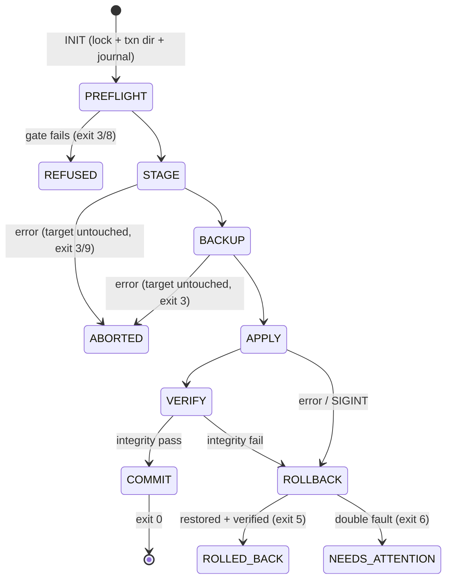

# P3 — Reliability Lens (SRE/Ops): Correctness Under Failure

Author: Reliability lens (SRE/ops). Status: proposal for adversarial committee. Scope:
transactional apply, verification, SQLite protocol, live installs, machine-bound enforcement,
rewrite engine, version skew, touchpoint discovery + trust model, hazards, failures, exit codes,
report schema.

Design creed: **a migration tool is judged on its worst day.** Every state-changing operation is
journaled before it happens, reversible after it happens, verifiable in between. Upstream already
paid for these lessons (NS-508, #68474, #27602, #68483, #51021, the 426,543-file backup incident
— hermes-backup-precedent.md; subsystem-state-layout.md §10); we inherit them as hard requirements.

## 1. Reliability invariants (non-negotiable)

I1. **Source is never written.** Capture opens everything read-only; DB snapshots use `mode=ro`
    URIs (mirrors `backup.py:342-369`, subsystem-state-layout.md §2.3); writes go only to the
    user-chosen output directory.
I2. **Target is never modified outside a journaled transaction.** No write to `$HERMES_HOME`
    before the journal record describing it is fsynced (write-ahead intent).
I3. **The pre-apply backup is sacred.** Never deleted by any failure path — only by explicit
    `talaria gc` or retention expiry after a committed, verified apply.
I4. **Both-sides filtering.** Machine-bound state is excluded at capture AND filtered again at
    apply — "never trust the archive's own hygiene" (hermes-backup-precedent.md,
    `_IMPORT_SKIP_NAMES` / NS-508 lesson).
I5. **Fail closed, report loud.** Integrity uncertainty aborts the phase with a specific numbered
    failure (§12) — never a silent skip appended to a log (anti-W13, competitor-teardown.md).
I6. **Dry-run everywhere.** Every mutating command has `--dry-run` producing the identical report
    JSON with `mode:"dry_run"` and zero side effects (claw-migrate dry-run-by-default precedent,
    subsystem-install-update.md §7).

## 2. Transactional apply state machine

### 2.1 States



STAGE/BACKUP failures need no rollback — the target has not been modified yet; the txn dir is
cleaned and the run reports as a refusal-grade abort. Rollback exists only once APPLY has begun.

- **INIT** — mint `txn_id`; create `$HERMES_HOME/.talaria/txn/<txn_id>/{journal.jsonl,stage/,backup/}`;
  acquire `$HERMES_HOME/.talaria/lock` (`O_CREAT|O_EXCL`, `pid\nstarted_at` body, stale-lock pid+age
  probe — same shape as upstream's update lock, subsystem-install-update.md §3). The txn root lives
  **inside the target home** so stage→final moves are same-filesystem atomic renames, honoring
  "stage on destination filesystem, never /tmp" (tmpfs truncation trap, `backup.py:705-710`,
  subsystem-state-layout.md §10 trap 5). `.talaria/` is in our own capture-exclusion registry.
- **PREFLIGHT** — read-only gate (§3).
- **STAGE** — extract selected payload into `stage/`, verifying every member SHA-256 during
  extraction (first mismatch rejects, exit 9); zip-slip containment via `os.path.commonpath`
  semantics + symlink/absolute-member rejection (anti-W9, competitor-teardown.md). Then the
  rewrite engine (§8) runs **in stage only**; post-rewrite hashes become the expected apply hashes.
- **BACKUP** — every final path the apply will touch is copied into `backup/` (relative path +
  mode + mtime preserved), hashed, journaled. The quick-state set (state.db, config.yaml, .env,
  auth.json, cron/jobs.json — mirrors `_QUICK_STATE_FILES`, subsystem-state-layout.md §6) is
  always backed up even when unselected, as a blast-radius floor.
- **APPLY** — per-artifact ops (§2.3), each journaled intent→done.
- **VERIFY** — two-phase (§4.3): integrity (gating) then functional (advisory).
- **COMMIT** — fsync `{"event":"commit"}`, delete `stage/`, retain `backup/` (default 7 days or
  2 completed applies, whichever is longer), write report, release lock. Post-commit,
  `talaria rollback --txn <id>` still works from the retained backup (as a new inverse txn).
- **ROLLBACK** — §2.4. **NEEDS_ATTENTION** — freeze: nothing deleted, journal + backup paths
  printed, exit 6.

### 2.2 Journal file

`journal.jsonl`, append-only, one JSON object per line, `f.flush()+os.fsync()` **before** the
described action executes. Torn final lines (power loss mid-write) are detected by JSON parse
failure and truncated on resume — JSONL is chosen precisely for this recovery property.

Record shapes:

```jsonc
{"seq":1,"ts":"...","event":"state","state":"APPLY"}
{"seq":2,"ts":"...","event":"op.intent","op_id":"a-0042","kind":"replace_file",
 "final":"cron/jobs.json","staged":"stage/cron/jobs.json",
 "pre_sha":"<sha256 of existing final or null>","expected_sha":"<stage sha256>",
 "mode":"0600","backup":"backup/cron/jobs.json"}
{"seq":3,"ts":"...","event":"op.done","op_id":"a-0042","post_sha":"..."}
```

Op kinds: `replace_file`, `create_file` (pre_sha null), `create_dir`, `replace_tree`
(dir renamed aside to backup, staged tree renamed in), `chmod`, `chown`, `delete_stale`
(runtime-file sweep, §7.3), `db_place` (snapshot placement + sidecar removal, §5.1).

### 2.3 Apply mechanics

- Files move stage→final via `os.replace` (atomic, same filesystem by construction); parent dirs
  created first as journaled `create_dir` (rollback removes only dirs we created); parent-dir
  fsync after batches on POSIX.
- Modes: secret files restored to 0600, dirs 0700, explicitly — zip drops mode bits
  (`backup.py:132` precedent; subsystem-state-layout.md §10 trap 10). Windows chmod is a no-op,
  mirroring upstream `_secure_file` (subsystem-cron.md §1.4); report notes "NTFS ACLs not managed".
- Running as root with a different gateway user ⇒ chown restored files to that user — incident
  #68483: root-owned `jobs.json` silently locks out the ticker (subsystem-cron.md §1.4).
- Never follow symlinks on either side (subsystem-state-layout.md §10 trap 3); never create empty
  legacy-layout dirs — they shadow real data via `get_hermes_dir(new, old)` semantics (#27602;
  §2.8, §10 trap 8).

### 2.4 Crash-resume and rollback

**Resume** (`talaria apply --resume`, auto-offered when a journal with no terminal record is
found at startup or in the GUI): replay the journal, then per state — PREFLIGHT/STAGE: restart
from STAGE (extraction idempotent, hash-verified). BACKUP: redo remaining backups
(copy-if-absent + hash check). APPLY: for each `op.intent` without `op.done`, hash the final
path — `== expected_sha` means the rename landed before the crash (journal `op.done`, continue);
`== pre_sha` means redo the op; anything else is third-party interference → ROLLBACK (T6).
VERIFY: rerun. ROLLBACK-in-progress: continue rollback with the same idempotent inspection.

**Rollback triggers:** T1 any op error (EACCES, ENOSPC, EBUSY, Windows sharing violation);
T2 integrity-verify failure; T3 SIGINT/SIGTERM (current op finishes, then rollback);
T4 stage/bundle hash mismatch discovered late; T5 preflight-invariant violated mid-apply
(gateway observed started — see §6.3); T6 resume finds unexplained target content.

**Rollback procedure:** walk journal in reverse; restore each backed-up original via
`os.replace` from `backup/`; remove `create_file`/`create_dir` entries we created; re-verify by
hashing restored files against journaled `pre_sha`. Success → ROLLED_BACK (exit 5). Any failure
during rollback → NEEDS_ATTENTION (exit 6): print journal path, backup path, and the exact
per-file manual restore commands. The tool never deletes `backup/` on any failure path (I3).

### 2.5 Capture-side pipeline (simpler, still crash-safe)

SCAN → SNAPSHOT (DBs, §5) → PACK → SELF-VERIFY → PUBLISH. Pack writes
`<name>.hermespack.partial`; PUBLISH is a single `os.replace` after SELF-VERIFY re-reads every
archive member against the manifest (atomic-output precedent, hermes-backup-precedent.md). A crash
leaves only a `.partial`, detected and offered for deletion next run. Capture never resumes
half-done packs — it restarts; the source is read-only, so restart is always safe.

## 3. Preflight gate (apply side)

All read-only; each check yields OK/WARN/FAIL with a stable id — modeled on `hermes doctor`'s
sectioned OK/WARN/FAIL + accumulated manual-action UX (hermes-internals-digest.md §3).

| ID | Check | FAIL behavior |
|---|---|---|
| PF-01 | Gateway not running: `gateway.pid` liveness probe + port probe; stale pid ⇒ WARN only | refuse; print `hermes gateway stop` |
| PF-02 | No `hermes backup` in flight: `.backup.lock` fresh (hermes-backup-precedent.md) | refuse; retry guidance |
| PF-03 | No update in flight: `.hermes-update-in-progress` (<20 min old, upstream Tauri max-age rule, subsystem-install-update.md §3) | refuse |
| PF-04 | Disk space ≥ payload × 2.2 (stage + backup + slack; upstream uses need×1.2 for one copy, subsystem-install-update.md §3 "Windows ZIP fallback") | refuse |
| PF-05 | Managed install: `$HERMES_HOME/.managed` / `HERMES_MANAGED` ⇒ NixOS activation owns config (subsystem-state-layout.md §8) | refuse (v1); print nix guidance |
| PF-06 | Version skew class (§9) | refuse on BLOCKED classes |
| PF-07 | Target Hermes present & healthy: `hermes --version` exits 0 (upstream's own smoke test, `tests/install/install-update-e2e.sh:239-246`, subsystem-install-update.md §10) | WARN if absent → "state-only restore" mode with install instructions |
| PF-08 | Filesystem: WAL-hostile fs (NFS/SMB/FUSE/WSL1) detection → journal-mode note (`hermes_state.py:520-545`, subsystem-state-layout.md §2.3) | WARN |
| PF-09 | Live one-shot crons in bundle with `run_at` already past ONESHOT_GRACE (120s; subsystem-cron.md §6) | WARN + needs_action list |
| PF-10 | TZ: bundle `timezone` config unset AND source system TZ ≠ target system TZ (#51021 trap, subsystem-cron.md §6) | WARN + offer to pin `timezone` |
| PF-11 | Target has lived-in state → conflict count preview; merge policy selected | interactive / flag-driven |
| PF-12 | Bundle schema version supported (§9.3) | refuse (exit 9) |

## 4. Verification design

### 4.1 What gets checksummed, when

1. **Capture read time** — every payload file hashed (SHA-256) as it is streamed into the zip;
   hash recorded in manifest. One read pass, no TOCTOU window between hash and pack.
2. **Pack self-verify** — full re-read of the finished archive; every member re-hashed vs
   manifest before publish (§2.5). Catches disk/RAM corruption at the cheapest possible moment.
3. **Stage extract** — every member hashed during extraction vs manifest (§2.1 STAGE).
4. **Post-rewrite** — rewritten files re-hashed; rewrite ops record `pre_sha`/`post_sha`.
5. **Post-apply integrity** — every applied path re-hashed vs expected (stage/post-rewrite) hash.
6. **Rollback verify** — restored originals re-hashed vs journaled `pre_sha`.

DB snapshots additionally record `PRAGMA page_size/page_count`, `schema_version`, source
`journal_mode`, and the app-level schema stamp where one exists (state.db `schema_version` +
`state_meta`, subsystem-state-layout.md §5).

### 4.2 Post-apply health checks (functional verify)

Run in order, each producing a report `checks[]` entry:

1. `hermes --version` exits 0 and parses "Hermes Agent vX (date)" (`_startup_fast.py:186`,
   subsystem-install-update.md §4).
2. `hermes doctor` when available — capture exit code, parse OK/WARN/FAIL section lines
   conservatively (no `--json` assumed); fold its manual-action list into our checklist
   (hermes-internals-digest.md §3).
3. SQLite `PRAGMA quick_check` on every restored DB, size-capped exactly like
   `verify_sqlite_integrity`: full check under 2 GiB, else O(1) header+schema probe (a real 30 GB
   state.db exists; `backup.py:405-413`, subsystem-state-layout.md §2.3, §10 trap 6).
4. Cron preflight mirror re-run: skill readiness env vars, provider key presence, delivery
   platform config, workdir existence, croniter/bash availability — mirrors
   `cron/scheduler.py:3695-3725` signals (subsystem-cron.md §4).
5. Secret-mode audit: .env/auth.json/state.db/mcp-tokens/pairing at 0600/0700 (POSIX).
6. Machine-bound absence sweep: none of the §7 registry landed on target (NS-508 class).
7. Legacy-dir shadow audit: no empty legacy-layout dirs created (#27602).
8. MCP entries re-validated with `validate_mcp_server_entry` semantics — Hermes *silently drops*
   invalid entries at spawn, so surface them now (subsystem-integrations.md §2.4 step 7).

### 4.3 Gating policy

- **Integrity checks (4.1 items 5, 4.2 items 3/6) are gating** → automatic ROLLBACK on failure.
- **Functional checks are advisory** → recorded as WARN/needs_action; they do NOT auto-rollback,
  because a doctor FAIL may reflect pre-existing target issues, not our apply. Default flow
  auto-commits after integrity passes; `--strict-verify` withholds COMMIT on any functional FAIL
  (exit 7) leaving the user to `talaria commit` or `talaria rollback` explicitly. GUI shows the
  same choice.

## 5. SQLite capture protocol

Mirrors the upstream-proven protocol (subsystem-state-layout.md §2.3; hermes-backup-precedent.md):

1. **Open** `sqlite3.connect(f"file:{src}?mode=ro", uri=True)`; snapshot via `conn.backup(dst)`;
   fail closed on any exception (`backup.py:342-369`). Never byte-copy a live DB (anti-W10).
2. **Sidecars** (`-wal`/`-shm`/`-journal`) never packed — fresh snapshot + stale sidecar = torn
   restore (`backup.py:78-89`).
3. **Zeroed-file detection** before snapshot: header magic + zero-page scan (`backup.py:372-396`,
   incident #68474). Zeroed ⇒ FAIL that artifact loudly; pack never includes it silently.
4. **Integrity** on the snapshot: header magic + `PRAGMA integrity_check` under 2 GiB, else O(1)
   schema probe (`backup.py:405-413`).
5. **Staging**: snapshot temps on the output/stage filesystem, never /tmp (`backup.py:705-710`).
6. **Contention**: `busy_timeout` 5000 ms; on `database is locked` or `SQLITE_READONLY_RECOVERY`
   (hot WAL needing recovery — unreadable in ro mode): 3 retries with backoff, then FAIL the
   artifact with quiesce guidance (§6.2). We never open read-write to force recovery (I1).
7. **Size caps**: per-DB soft cap (default 8 GiB, `--db-cap`); over-cap DBs require explicit
   confirmation — the 30 GB state.db precedent proves they exist.
8. **Recorded**: pragmas + hash per §4.1; for state.db also the enumerated `sessions.cwd` set for
   the touchpoint ledger (mirrors `hermes_state_portability.py:41-68`).

### 5.1 Apply-side DB placement (`db_place` op)

Before placing a snapshot: delete any existing `-wal`/`-shm`/`-journal` sidecars at the final
path (journaled `delete_stale`, originals backed up) — a restored main file next to a stale
foreign WAL is the exact torn-restore hazard upstream excludes sidecars to prevent. After
placement: `PRAGMA quick_check` (size-capped) + journal-mode note when target fs is WAL-hostile
(PF-08).

### 5.2 Content scrubs on DB snapshots (in stage, never on source)

- `cron/executions.db`: delete non-terminal rows (`claimed`/`running`/`unknown`) — recovery
  probes pid liveness and *fails safe to alive*, so foreign rows linger forever on the new
  machine (`cron/executions.py:199-233,116`, subsystem-cron.md §3.2). Ledger is audit-only, never
  a retry queue (docstring cited there), so deletion is safe.
- state.db: no row scrubs by default; `sessions.cwd`/`git_repo_root` handled by the rewrite
  engine (§8.5) or flagged, per user choice.

## 6. Live-install handling

### 6.1 Capture on a live source (allowed, with eyes open)

- **Locks honored (read-only):** `.backup.lock` fresh ⇒ warn "a hermes backup is running;
  captured state may lag it" — we never *take* the lock (taking it writes, violating I1).
  `.hermes-update-in-progress` fresh ⇒ **refuse capture**: mid-update trees are incoherent
  (autostash/checkout in flight, subsystem-install-update.md §3). `cron/.tick.lock`/`.jobs.lock`:
  detect only — jobs.json is atomic-write-published (`cron/jobs.py:1288-1340`), point reads are
  coherent.
- **Gateway-running warning:** pid + process probe ⇒ banner: "Gateway is running. Each database
  snapshot is internally consistent, but cross-file skew is possible (a message may appear in
  state.db but not response_store.db). For a perfectly coherent capture run `hermes gateway stop`
  first." Manifest records `capture_mode: "live"|"quiesced"`; `--require-quiesced` (and the GUI
  toggle) makes gateway-down a hard gate.

### 6.2 Quiesce guidance

One screenful, generated with the profile-correct service names (names derive from HERMES_HOME,
`gateway.py:1851-1861`, subsystem-cron.md §2.2): `hermes gateway stop` (per profile), confirm
`cron/ticker_heartbeat` stops advancing, re-run capture, restart gateway. Termux note: ticker
only runs inside a foreground gateway (subsystem-cron.md §6) — quiesce = close the app.

### 6.3 Apply requires a quiet target

Apply hard-gates on PF-01..03. We cannot OS-lock Hermes out, so APPLY re-probes the gateway pid
between op batches; if a gateway starts mid-apply we trigger T5 rollback rather than race a live
writer. The final screen (§11) is where the gateway gets started again — never automatically.

## 7. Machine-bound enforcement — both sides

### 7.1 Single registry, two enforcement points

One compiled `EXCLUSION_REGISTRY`: `{id, glob(s), scope: capture|apply|both, reason, citation}`.
Capture never packs `both`/`capture` entries; pack asserts none slipped in (belt); apply filters
again against `both`/`apply` entries **regardless of what the bundle contains** (I4) — protecting
against older-tool bundles, hand-edited bundles, and plain `hermes backup` zips accepted as
degraded input (hermes-backup-precedent.md "Interop decisions").

### 7.2 Registry contents (grounded)

- Runtime/identity: `gateway_state.json` (NS-508), `gateway.pid`, `cron.pid`, `gateway.lock`,
  `processes.json`, `.clean_shutdown`, `.restart_*.json`, `gateway/dead_targets.json`,
  `gateway/restart_loop.json`, `pending_messages/`, `runtime/` (subsystem-state-layout.md §2.7).
- Locks/heartbeats: `auth.lock`, `.backup.lock`, `cron/.tick.lock`, `.jobs.lock`,
  `.mcp-discovery.lock`, `.usage.json.lock`, `cron/ticker_*` (subsystem-cron.md §1.2).
- Host-shape markers: `.container-mode`, `.managed`, home-scoped `.install_method`,
  `.gateway-launchd-unsupported`, `.termux_bundled_sync_stamp`, build stamps, `.update_check`,
  `skills/.sync_device_id` (subsystem-skills-plugins.md "Recommended capture set").
- Binaries/venvs/native: `hermes-agent/`, `node/`, `node_modules/`, `bin/`, `lib/libfts5_cjk.so`,
  `lsp/bin/`, `git/`, `mcp-installs/`, any `venv`/`site-packages` (subsystem-state-layout.md §2.9)
  — cross-OS venv copies are impossible (ABI stamps, `lazy_deps.py:411-450`).
- Path-hashed caches: `checkpoints/store/` (sha256(abs_path) keys — unrecoverable), `sandboxes/`,
  `chrome-debug/` (OS-keyring-encrypted Chromium profile, subsystem-integrations.md §5).
- Device-linked (policy-excluded; opt-in only, with loud warning): `whatsapp/session/`,
  signal-cli store, `platforms/matrix/store/`+crypto.db, weixin accounts
  (subsystem-integrations.md §1.2).
- OS-registered artifacts are never captured at all: units/plists/schtasks/.vbs/.desktop bake
  absolute paths — regenerate via `hermes gateway install` (subsystem-integrations.md §1.4).

### 7.3 Scrub-transforms (content-level machine-boundness)

Applied in stage, journaled as rewrite ops: cron `run_claim`/`fire_claim` → null and
`preflight_alerted`/`drift_alerted` dropped — `_machine_id()` is `hostname:pid` and a stale
foreign claim younger than TTL suppresses the first fire on the new machine
(`cron/jobs.py:2996-3003, 2795-2808`, subsystem-cron.md §1.3); executions.db non-terminal rows
(§5.2); desktop `desktop-installation.json` installationId regenerated
(subsystem-install-update.md §5). Apply additionally sweeps stale runtime files already on the
target the way container boot does (`container_boot.py:75,417-418`, subsystem-state-layout.md §8).

## 8. Path/host rewrite engine

### 8.1 Principles

Structured, per-format, key-addressed editing. **No blanket regex over file contents, ever**
(anti-W7). Regex may *find* candidates during discovery (§10), but every *edit* is addressed to a
schema-known field in a parsed or structurally-located position. Every op is previewable
(old→new diff), individually skippable, and recorded in the report with rule-id + citation.

### 8.2 The Rewrite Plan

```jsonc
{"op_id":"rw-0007","file":"cron/jobs.json","format":"json",
 "locator":{"path":["jobs",3,"workdir"]},
 "old":"/home/alice/projects/site","new":"/home/bob/projects/site",
 "rule":"cron-workdir-home-remap","status":"auto|needs_review|manual",
 "pre_sha":"...","post_sha":"..."}
```

Built from the mapping table (source home → target home, source user → target user, layout
family translation `~/.hermes` ↔ `%LOCALAPPDATA%\hermes`) plus per-key rules. Anything not
covered by a rule with an exact locator becomes `needs_review` — shown, never auto-applied.

### 8.3 Format editors (stdlib-only)

- **JSON** (`cron/jobs.json`, `channel_directory.json`, plugin state…): `json.loads` → targeted
  mutation → `json.dumps(indent=2)` matching Hermes' own writer (`cron/jobs.py:1288-1340`);
  key order preserved by dict semantics. Rewrites of cron `script`/`skills` reuse upstream
  semantics: absolute script paths rewritten relative to `$HH/scripts/` (they are hard-contained
  there and blocked otherwise, `cron/scheduler.py:2958-2971`); absolute skill refs → names
  (extractor/rewriter precedent `referenced_skill_names()`/`rewrite_skill_refs()`,
  `cron/jobs.py:3129-3271`, subsystem-cron.md §4/§5).
- **dotenv** (`.env`): line-oriented editor — only lines matching `KEY=` for an exactly named
  key are touched, value substring replaced, every other byte preserved (comments, order, blanks).
- **YAML** (`config.yaml`): stdlib has no YAML parser, and PyYAML round-trips destroy comments.
  Editor = indentation-aware key-path scalar locator: walks the document tracking the key path by
  indent level, finds the unique line for a target path (`terminal.cwd`,
  `mcp_servers.<name>.command`, …), and replaces only that line's scalar portion. It **refuses**
  (→ `needs_review` with exact manual instructions) on anchors/aliases, block scalars (`|`/`>`),
  multi-line flow collections, duplicate keys, tabs. Validation: when a Hermes venv exists, shell
  its python to `yaml.safe_load` both versions and assert the parse trees differ only at the
  targeted paths (constraint-2 enrichment); without a venv, the editor's own reparse must find the
  new value at the same path or the op reverts to `needs_review`. Structurally anchored,
  independently validated — not regex (constraint 1 honored).
- **SQLite** (stage snapshots only): parameterized `UPDATE`s in one transaction, e.g.
  `sessions.cwd`/`git_repo_root` prefix remaps (columns enumerated by
  `hermes_state_portability.py:41-68`); row counts recorded per op; `quick_check` after commit.
- **Never rewritten**: units/plists/tasks/.desktop (regenerated, §7.2); scripts and skill bodies
  (user code — path hits inside them are *flagged* with file:line, never edited); anything binary.

### 8.4 Known-key rule catalog (initial)

config.yaml: `terminal.cwd`, `mcp_servers[].command/args/cwd/url/ssl_verify/client_cert/client_key`,
`lsp.*`/`browser.*` binary paths, `prefill_messages_file`, `model.base_url` (localhost ⇒ flag),
`dashboard.public_url` (flag — external re-point), `skills.external_dirs[]`,
`cron.chronos.callback_url` (flag; source-armed one-shots orphaned, subsystem-cron.md §2.3);
special op: **pin `browser.camofox.user_id` to the source-derived uuid** — identity is
uuid5(abs state-dir path), silently changes on move, orphaning all browser logins
(`tools/browser_camofox_state.py:18-46`, subsystem-integrations.md §5). cron/jobs.json:
`workdir` (remap or flag), `script`/`monitor_script` (relative-ize). `.env` URL-valued vars
(`SIGNAL_HTTP_URL`, `HASS_URL`, `CAMOFOX_URL`, `N8N_BASE_URL`, `BROWSER_CDP_URL` — secret when it
embeds `?token=`) → flag/remap. mcp-tokens `*.client.json` loopback port → flag reauth-maybe
(subsystem-integrations.md §2.2). `${VAR}`-interpolated MCP entries need no rewrite —
migration-friendly by design (subsystem-integrations.md §2.1).

### 8.5 POSIX ↔ Windows translation policy

Separator/root translation happens **only** on rule-addressed path-valued fields, using the
mapping table. Embedded paths in free text (prompts, SOUL.md, scripts) are reported with
locations, never edited. 8.3 short names on Windows are resolved before comparison
(install.ps1 precedent, subsystem-install-update.md §1).

## 9. Version-skew policy

### 9.1 Recorded at capture

`{hermes_version (__version__), release_date, git_head, git_tag, git_dirty, .hermes_build_sha?,
install_method (7-step algorithm, config.py:412-513), _config_version, state_db_schema_version,
lazy_features[] (active_features() via source venv), os, arch, layout_family, python}`
(subsystem-install-update.md §4, §9; subsystem-state-layout.md §5).

### 9.2 Skew classes at apply

| Class | Condition | Policy |
|---|---|---|
| EXACT | same commit/tag | proceed |
| FORWARD-OK | target newer, bundle `_config_version` ≥ 12 | proceed; Hermes migrates configs forward on load (table-driven, floor 12 — `config_migrations.py:52`, subsystem-state-layout.md §3); report notes "forward-migrated"; skills may surface rename/duplicate collisions — flagged (subsystem-skills-plugins.md §8) |
| FLOOR-BREACH | bundle `_config_version` < 12 | WARN hard: upstream leaves such configs untouched + "run hermes setup" — we mirror that message |
| BLOCKED-DOWNGRADE | target older than source | refuse (exit 8): config/state schema downgrades are undefined upstream. Remediation printed: `hermes update` the target, or install at the source commit — installer supports `--commit <sha>` / `-Commit` (subsystem-install-update.md §12) |
| UNKNOWN | version undetectable either side | refuse (exit 8) unless `--force-skew`, which records the override in the report |

Recommended (and GUI-default) path: install target Hermes at the **same commit** as source
before apply, then `hermes update` both at leisure — never mid-migration.

### 9.3 Bundle schema skew

Manifest `schema_version: N`. Applier accepts N and N−1 (with internal migration); newer than N
⇒ refuse (exit 9) with "upgrade talaria" message. Plain `hermes backup` zips are detected by
marker heuristics and accepted as degraded input with reduced intelligence, per precedent interop
decision (hermes-backup-precedent.md).

## 10. Day-to-day touchpoint discovery (with trust model)

Three evidence layers feed one **touchpoint ledger**; every entry carries
`provenance ∈ {config-ref, cron-ref, skill-ref, plugin-ref, db-mined, log-mined, agent-reported}`
and `confidence ∈ {verified, corroborated, advisory}`.

### 10.1 Layer 1 — static reference chasing (deterministic)

Chase every path/host/env reference out of: config.yaml machine-specific keys (§8.4);
`skills.external_dirs` (hermes-internals-digest.md §2); cron jobs — `script`, `workdir`, absolute
`skills`, `monitor_url`, `context_from` (job-graph closure: referenced jobs + output dirs migrate
together, subsystem-cron.md §4); skill frontmatter `required_environment_variables` (the only
enforced dep, resolved `.env`-then-environ, `tools/skills_tool.py:340-405`,
subsystem-skills-plugins.md §6) plus advisory `prerequisites.commands`/pip; plugin `requires_env`
(the machine-readable credential manifest, subsystem-integrations.md §1.1); memory-provider
`backup_paths()` externals; the MCP enumeration recipe steps 1–8 (subsystem-integrations.md §2.4).
Every reference is `lstat`ed and classified: exists / inside-home / outside-home / class (a)–(d).

### 10.2 Layer 2 — dynamic mining (read-only, verified)

- state.db: enumerate distinct `sessions.cwd`/`git_repo_root` (the agent's actual working
  directories — `hermes_state_portability.py:41-68`); each stat-verified, git-repo detection noted.
- cron `output/` + executions: which jobs actually ran recently; `.usage.json`: which skills are
  actually used (last_used_at) — feeds "active vs dormant" labels (subsystem-skills-plugins.md §5).
- Logs: bounded tail scan (default last 32 MiB of agent.log/gateway.log) extracting path-shaped
  and URL-shaped tokens by pattern; **every candidate is stat/parse-verified before it may enter
  the ledger** — pattern-matching is a metal detector here, never an editor (§8.1 distinction).

### 10.3 Layer 3 — the generated Deep-Scan skill (advisory by construction)

`talaria deepscan generate` emits a self-contained skill dir (`talaria-deep-scan/SKILL.md` +
schema doc) the user gives their running agent. The skill instructs the agent to inventory: shell
tools it invokes day-to-day, paths it reads/writes outside HERMES_HOME, services/URLs it talks
to, credentials it knows it uses — written as JSON to a named output file including a **run nonce**
talaria minted into the skill (rejects stale/copied reports).

**Trust model (the load-bearing part):** agent self-reports cannot be trusted (owner's brief).
1. Agent-reported items can **never** silently expand the capture set, mark anything
   machine-safe, or alter exclusions/scrubs. Ingest is schema-validated, size-capped (1 MiB),
   nonce-checked, path-sanitized; strings are untrusted data, never executed.
2. Each item is probed (lstat/URL-parse only). Probe-confirmed ⇒ `agent-reported/verified`, shown
   as a normal candidate the **user** may opt into capture. Unconfirmable ⇒ advisory, rendered in
   a separate "agent said, unverified" report section.
3. An agent item matching a Layer-1/2 finding *corroborates* it — tag-union merge, never
   replacement.
4. The ledger records absence too: Layer-1/2 findings the agent did NOT mention are tagged
   `agent-blind`, calibrating how much the user should trust the self-report.

## 11. Concurrent-run hazards (two live machines)

The dangerous window is *after* a successful apply: platform failure modes are **account
unlinking and message splitting, not startup errors** (subsystem-integrations.md §8.8).

| Platform | Both-machines failure | Source |
|---|---|---|
| WhatsApp (Baileys) | device slot fight → account **unlinked** | subsystem-integrations.md §1.2 |
| Signal | linked-device conflict (single-device store) | ibid |
| Matrix | concurrent Olm use **corrupts crypto.db** (E2EE breaks) | ibid |
| Telegram | polling conflict → 409s, message loss/split | ibid |
| Relay | `gw-<hostname>` enrollment collision | ibid |
| Chronos cron | source-armed one-shots fire against dead callback_url | subsystem-cron.md §2.3 |

Tool behaviors: (1) apply **never** auto-starts the gateway; the finish step demands an explicit
"start gateway here" action gated behind the hazard list filtered to platforms actually
configured in the bundle. (2) `talaria decommission` prints (and can execute on the source) the
per-platform shutdown: `hermes gateway stop`, disable service units, and the note that WhatsApp
re-pair / Matrix store moves require the source to STAY stopped. (3) `hazards[]` carries the
"source-of-truth election": run the gateway on exactly one machine; the other's service is
disabled, not merely stopped.

## 12. Failure-mode catalog (what the user sees)

| ID | Failure | Detection | Behavior | User sees | Exit |
|---|---|---|---|---|---|
| F01 | No Hermes home found | resolver walk (env→HKCU→defaults) | refuse capture | "No Hermes install found; looked at: …" | 3 |
| F02 | Update in progress | PF-03 / capture check | refuse | "Hermes is mid-update; retry when done" | 3 |
| F03 | DB locked/hot-WAL unreadable | §5 item 6 | retry ×3 → fail artifact, fail capture unless `--skip-artifact` | quiesce guidance screen | 4 |
| F04 | DB zeroed | §5 item 3 | fail artifact, name incident class | "state.db appears zeroed (known Hermes incident #68474); source DB is damaged" | 4 |
| F05 | DB integrity_check fails | §5 item 4 | fail closed | "snapshot failed verification; nothing packed" | 4 |
| F06 | Disk full during pack | ENOSPC | delete `.partial`, report need | "Need ~X GiB free at <path>" | 4 |
| F07 | Bundle member hash mismatch | STAGE | refuse before any target write | "Bundle corrupt at <member>; re-copy the .hermespack" | 9 |
| F08 | Bundle schema too new | PF-12 | refuse | "Made by newer Talaria; upgrade this tool" | 9 |
| F09 | Gateway running on target | PF-01 | refuse | "Stop the gateway first: `hermes gateway stop`" | 3 |
| F10 | Managed (NixOS) target | PF-05 | refuse | nix-specific guidance | 3 |
| F11 | Downgrade skew | §9.2 | refuse | remediation with exact `--commit` command | 8 |
| F12 | Crash/power loss mid-apply | journal without terminal record | on next run: offer resume/rollback | "An apply was interrupted at step N of M — Resume / Roll back" | — |
| F13 | Apply op error (perm, ENOSPC, Windows lock) | T1 | automatic rollback + verify | "Apply failed at <file>; your previous state was restored (verified)" | 5 |
| F14 | Integrity verify fail post-apply | T2 | automatic rollback | same as F13 + failing file list | 5 |
| F15 | Rollback double-fault | rollback op error | freeze, delete nothing | "Manual attention required" + journal/backup paths + per-file commands | 6 |
| F16 | Functional verify FAIL (doctor etc.) | §4.3 | commit (default) or withhold (`--strict-verify`) | check table + needs_action items | 0 / 7 |
| F17 | YAML rewrite ambiguity | §8.3 | op → needs_review | diff preview + "apply manually" instructions | 0 |
| F18 | Vault requested, no `cryptography` | import probe | honest refusal, never home-rolled | "Encrypted vault needs 'cryptography' (pip install …) — or use the Handoff Checklist" | 3 |
| F19 | One-shot crons past grace | PF-09 | apply proceeds; jobs listed | "These one-shots expired mid-move; recreate: …" (>120s rule) | 0 |
| F20 | TZ mismatch, no pinned timezone | PF-10 | warn + offer pin | schedule-shift explanation (#51021) | 0 |
| F21 | Concurrent talaria run | `.talaria/lock` | refuse second instance | "Another migration is running (pid …)" | 3 |
| F22 | Unknown/future artifact in home | scanner residue pass | never silently dropped: listed as `unrecognized`, default-carried under quarantine prefix | inventory row "unrecognized — carried as-is" | 0 |

GUI renders the same catalog entries (same IDs) as the CLI; report JSON always contains the
triggering IDs.

## 13. Exit codes (stable, scriptable)

```
0  success (report may contain warnings + standard post-restore checklist)
1  unexpected internal error (traceback captured into report)
2  usage error (argparse)
3  refused — environment/preflight; nothing was modified
4  capture integrity failure — no bundle published
5  apply failed — rollback succeeded, target restored and verified
6  apply failed — rollback incomplete: NEEDS_ATTENTION (manual recovery documented)
7  applied but commit withheld pending decision (--strict-verify)
8  compatibility/version-skew block; nothing was modified
9  bundle unreadable / corrupt / schema unsupported; nothing was modified
```

Guarantee encoded in the codes: **only 5/6/7 imply the target was touched; 6 is the only state
where the tool could not restore it — and even then the pre-apply backup exists intact (I3).**

## 14. Machine-readable report schema (v1)

Written for every run (capture, apply, dry-run, verify, rollback) as `report.json` + rendered
`summary.md`: beside the bundle for capture, under `$HERMES_HOME/migration/talaria/<ts>/` for
apply — adopting claw-migrate's output layout, ItemResult shape, stable status/reason vocabulary,
and its 13 anti-overclaiming reporting rules wholesale (subsystem-install-update.md §7).

```jsonc
{"schema_version":1,
 "run":{"id":"...","tool_version":"...","command":"apply","mode":"execute|dry_run",
        "started":"...","finished":"...","exit_code":0,"txn_id":"..."},
 "source_system":{/* §9.1 snapshot */}, "target_system":{/* same shape */},
 "skew":{"class":"FORWARD-OK","detail":"..."},
 "selection":{"preset":"user-data","overrides":[/* per-artifact */]},
 "artifacts":[{"id":"cron/jobs.json","kind":"cron-store","class":"a",
   "status":"migrated|rewritten|skipped_machine_bound|skipped_policy|skipped_user|conflict|error|needs_action|verified|unrecognized_carried",
   "reason":"stable-reason-string","bytes":1234,"sha256":"...","provenance":["config-ref"]}],
 "rewrites":[/* §8.2 ops incl. status + pre/post sha */],
 "exclusions":[{"id":"gateway-state","path":"gateway_state.json","side":"apply",
                "reason":"machine-bound (NS-508)","citation":"subsystem-state-layout.md §2.7"}],
 "scrubs":[{"id":"cron-claims","count":3,"citation":"subsystem-cron.md §1.3"}],
 "touchpoints":[{"path":"/home/alice/projects/site","confidence":"corroborated",
                 "provenance":["cron-ref","db-mined","agent-reported"],
                 "verdict":"outside-home; remap available"}],
 "checks":[{"id":"HC-01","name":"hermes --version","result":"ok|warn|fail","detail":"..."}],
 "failures":[{"id":"F17","detail":"..."}],
 "actions":[{"id":"repair-whatsapp","platform":"whatsapp","command":"hermes whatsapp",
             "text":"Re-pair WhatsApp (QR)"}],
 "hazards":[{"id":"concurrent-whatsapp","text":"...unlinked...","source":"subsystem-integrations.md §1.2"}],
 "journal":{"path":".talaria/txn/<id>/journal.jsonl","final_state":"COMMIT"},
 "backup":{"path":".talaria/txn/<id>/backup/","retained_until":"..."}}
```

`actions[]` is the Secrets Handoff Checklist's structural sibling: every re-pair/reauth/re-enroll/
reinstall step keyed to findings with the exact command (`hermes mcp reauth --all`,
`hermes gateway install`, `hermes gateway enroll`, `hermes dashboard register`, `hermes whatsapp`,
`npm install` for the WhatsApp bridge, `hermes mcp install official/n8n`, `hermes doctor`) — the
checklist upstream never generates but whose necessity its own code proves
(subsystem-integrations.md §8.7; hermes-internals-digest.md §5 finding 6).

## 15. Constraint compliance notes — and no challenge raised

I examined all eight constraints for reliability cost and **raise no CONSTRAINT CHALLENGE**.
Two compliance notes with teeth:

1. Constraint 7 ("strictly read-only capture") means we must not *take* `.backup.lock` (creating
   it is a write) — we detect-and-warn instead (§6.1) — and a hot-WAL DB needing recovery is
   uncapturable in `mode=ro`: we fail closed with quiesce guidance rather than open read-write
   (§5 item 6). Upstream's backup shares this property; inherited behavior, documented.
2. Constraint 1 (stdlib-only) bites hardest on YAML rewriting. §8.3's indentation-anchored
   scalar editor with refuse-on-ambiguity plus venv-assisted validation is the honest solution;
   blind regex (W7) stays banned even where convenient.

## 16. Three decisions I will defend hardest in committee

1. **Write-ahead JSONL journal with hash-based crash resume (§2.2/§2.4)** — it converts every
   crash, ENOSPC, and Ctrl-C into a boring, provable recovery instead of a support ticket.
2. **Both-sides machine-bound enforcement from one registry (§7)** — NS-508 happened to the
   upstream team who *wrote* the exclusions; the archive can never be trusted to be clean.
3. **Advisory-only agent evidence (§10.3)** — the Deep-Scan skill makes discovery dramatically
   better while structurally unable to make capture worse: agent output can propose and
   corroborate, never decide.
